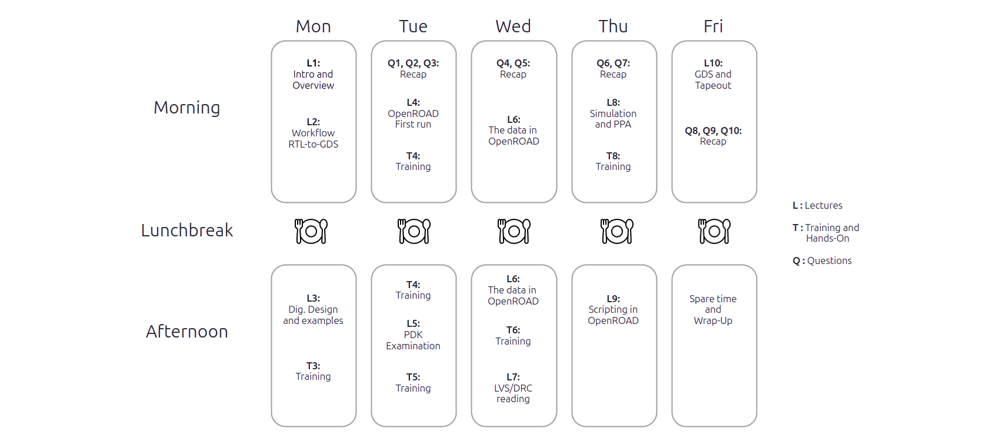
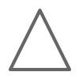
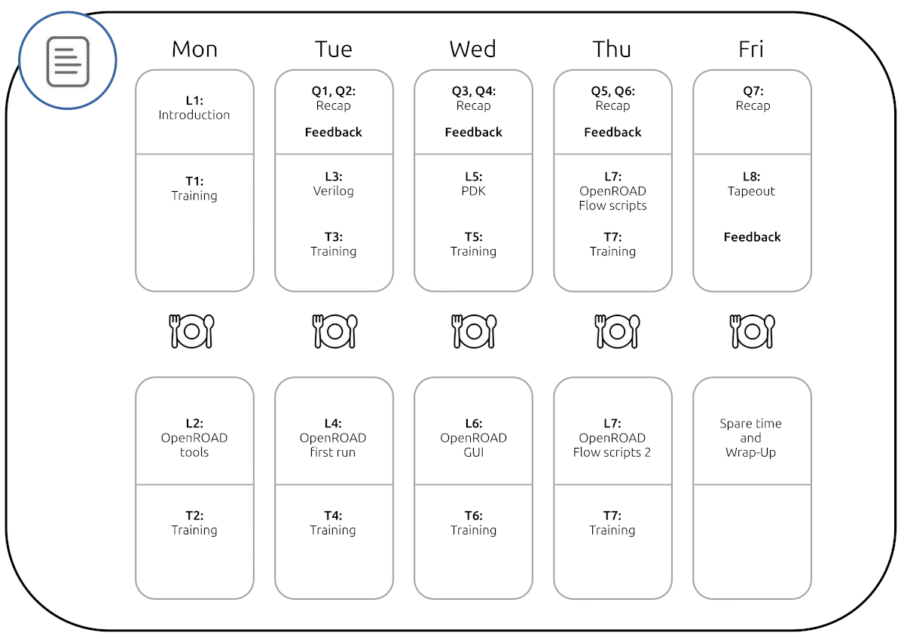
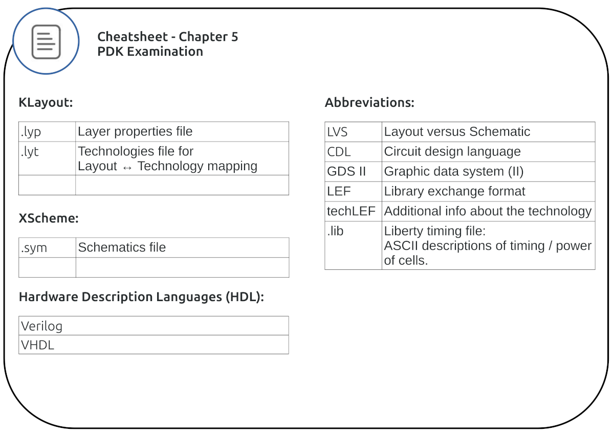
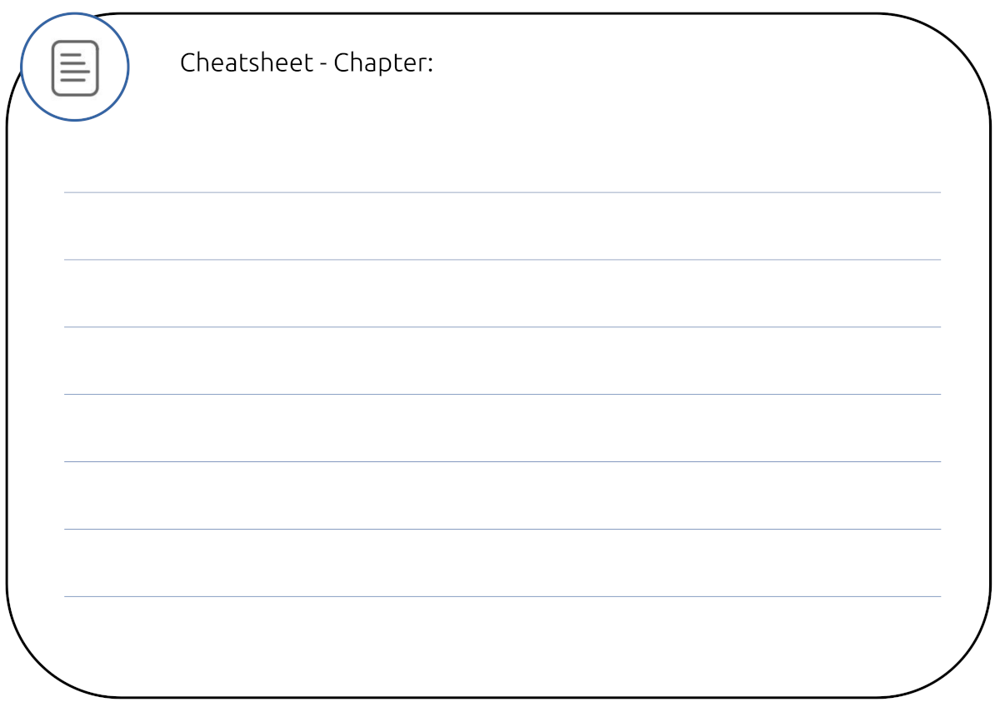
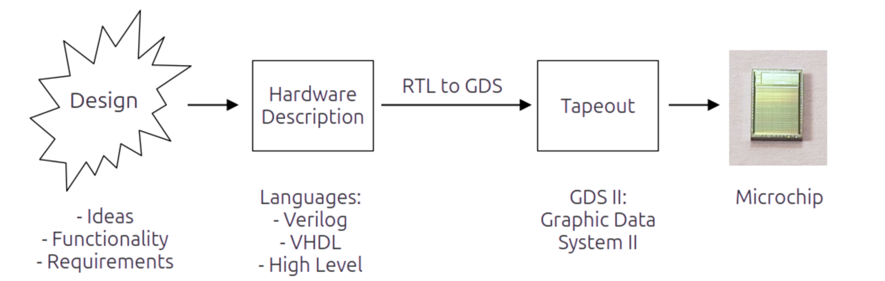
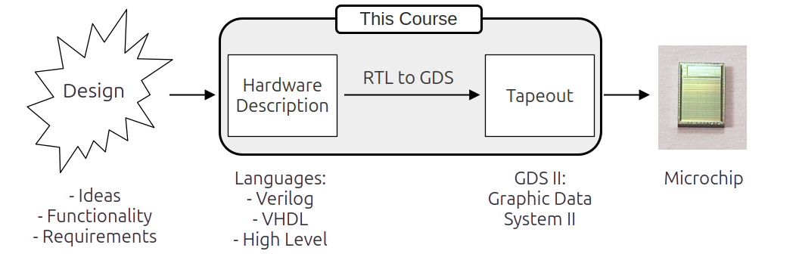
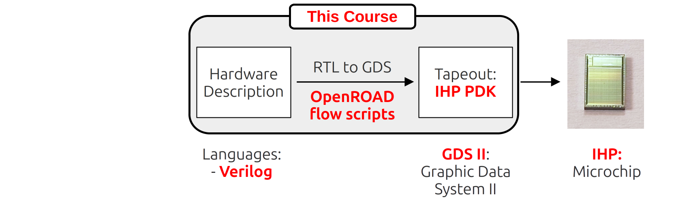

# Chapter 1 - Introduction and overview

## Welcome

### The next 5 days

- A few words to start with.

### Trainer profile

Me:

##### Name, Company / Uni

##### Why i'm here. My motivation.

##### What i've done before.

##### What interests me most.

### Participants backgrounds and motivations

You:

##### Name, Company / Uni

##### Why i'm here. My motivation.

##### What i've done before.

##### What interests me most.

## Course overview

### Chapter names
 
::: columns

:::: {.column width=50%}

* 1 Introduction
* 2 OpenROAD tools
* 3 Verilog
* 4 OpenROAD first run

::::

:::: {.column width=50%}

* 5 PDK
* 6 OpenROAD GUI
* 7 OpenROAD flow scripts
* 8 Tapeout

::::

:::

### Schedule for the course

## Course components

### Get the course materials here:

Course materials (Release):

[https://github.com/OS-EDA/Course/releases](https://github.com/OS-EDA/Course/releases)

- Download the latest release
- Unpack into a directory
- There might be daily updates during the course week!

### Additional course related links:

OS-EDA Github organization:

[https://github.com/OS-EDA](https://github.com/OS-EDA)

Course Github repository:

[https://github.com/OS-EDA/Course](https://github.com/OS-EDA/Course)

### Duplicated content versus internet links

The course slides

- contain Links to the Internet for a lot of topics.
- do not contain duplicated content (or as less as possible).

This means:

- Follow the links and read there. It is important content for the course.
- The links are carefully curated. It's not spamming.
- Don't expect all the content beeing duplicated into the course slides.

#####
A brief discussion about pros and cons of this.

### Lectures
::: columns

:::: {.column width=15%}

::::

:::: {.column width=15%}

::::

:::: {.column width=70%}
#####
Lectures:

* All the chapters start with a lecture slide deck.
* The trainer will walk you trough the content of the lectures.
* Whenever you have a question inbetween: ask directly.
* The lectures contain the base knowledge of the course.

::::

:::

### Trainings

::: columns

:::: {.column width=10%}

::::

:::: {.column width=10%}

::::

:::: {.column width=80%}
#####
Common training tasks:

Every training sessions starts with the common part. The tasks of the common part are sufficient to follow along the content of the course. If you're a beginner, these trainings should be your goal to reach.

::::

:::

::: columns

:::: {.column width=10%}

::::

:::: {.column width=10%}

::::

:::: {.column width=80%}
#####
Advanced training tasks:

The advanced training sessions are for those With pre knowledge. If the common training was finished fast or was just to easy, the advanced sessions get you convered. 

::::

:::

::: columns

:::: {.column width=10%}

::::

:::: {.column width=10%}

::::

:::: {.column width=80%}
#####
Bonus training tasks:

Still time left to do some tasks? Want something to take with you as homework? Please enjoy the bonus rounds of the training sessions.

::::

:::

### Questions
::: columns

:::: {.column width=15%}

::::

:::: {.column width=85%}

::::

:::

Questions:

* The questions are for re-visiting and remembering a previous chapter. 
* They guide an interactive session between the trainer and the room:
    * Trainer: Asks the questions.
    * Room: Answers the questions. 
        * Skipping a question is fine. 
        * Not knowing the answer is fine.
        * This is not an exam, not a test and not a challenge.
        * It is meant as a helpfull and hoepfully enjoyable way to recap yesterdays content.
    * If no answer is found, the trainer helps with the answer.

## Feedback and Cheat Sheets

- We please you to give us feedback for the course.
- There is a short timeframe each day reserved for feedback.

We have two ideas about this:

1. Developing Cheatsheets together
2. Collecting general feedback

### Cheetsheets

::: columns

:::: {.column width=15%}

::::

:::: {.column width=15%}

::::

:::: {.column width=70%}

Some things are really hard to remember:

* Abbreviations 
* Complex relations and graphics
* EDA tools workflow
* Schedule of the week
* Mathematics (joking, wer're not doing math here)
* ...

::::

:::

#####
 
* That is why we would like to develop Cheatsheets with you.
* They're made for cheating the hard parts.
* Cheatsheets work best when printed as handouts. 
* One can have them nearby the computer while learning.

### Cheatsheet example

### Cheatsheet example

### Empty Cheatsheet printversion

### Empty Cheatsheet document link

Empty Cheatsheet OpenOffice doc:

[https://github.com/OS-EDA/Course/tree/main/Chapter_01_Introduction/pics_lecture](https://github.com/OS-EDA/Course/tree/main/Chapter_01_Introduction/pics_lecture)

### General feedback

Genral feedback:

- The general feedback will be collected verbaly in the room. 
- Everyone has the opportunity to give feedback
- We will write down the feedback, without your name.

### What will happen with your feedback?

- We will put the feedback into Github issues.
- Right now, think of Github issues as some sort of tracker- or ticketsystem.
- Your feedback will not be connected to you (Anonymous).
- You can join a public discussion in the Github issues, if you want to.

Weblink to the issues of the course:

[https://github.com/OS-EDA/Course/issues?q=is%3Aissue](https://github.com/OS-EDA/Course/issues?q=is%3Aissue)

## The Training sessions

### Login at IHP

- Onboarding to the computers for everyone

### Levels
* The Trainings should create success points inbetween lectures
- This is going too slow for me:
    * Try the advanced and bonus trainings (even from past chapters)
- This keeps me busy every minnute:
    * Stick to the common trainings. You will be able to follow all chapters then.

## Certificate

We will explain live about the certificate of the course.

## Open-source EDA for digital designs

### Digital designs

There are:

- **Digital designs** This course!
- Analog designs (Upcoming course)
- Mixed signal designs
- Artwork designs (i.e. Minimal Fab Contest)
    * [https://github.com/mineda-support/Semicon2023-MinimalFab-Design-Contest](https://github.com/mineda-support/Semicon2023-MinimalFab-Design-Contest)
- Your fancy design?

**From now on: This course means digital design, even if not mentioned everywhere again**

### From design to microchip

### RTL to GDS toolchain

### RTL: Register Transfer Level

![RTL (Screenshot from Wikipedia [^1])](pics_lecture/rtl_wikipedia.png)

[^1]: [https://en.wikipedia.org/wiki/Register-transfer_level](https://en.wikipedia.org/wiki/Register-transfer_level)

### GDS: Graphic Data System (II)

![GDS (Screenshot from Wikipedia [^2])](pics_lecture/gds_wikipedia.png)

[^2]: [https://en.wikipedia.org/wiki/GDSII](https://en.wikipedia.org/wiki/GDSII)

### The GDS II Format (Specifications)

Here are two links about the strcuture, format and elements of GDS II. The links are for reference reasons. It is not strictly necessary to read or learn the GDS II format for this course. But it might help understanding.

[https://boolean.klaasholwerda.nl/interface/bnf/gdsformat.html](https://boolean.klaasholwerda.nl/interface/bnf/gdsformat.html)

[https://www.rulabinsky.com/cavd/text/chapc.html](https://www.rulabinsky.com/cavd/text/chapc.html)

### Naming of RTL-to-GDS tools:

The naming of the tools is confusing:

- RTL-to-GDS 
- = RTL-2-GDS 
- = End-to-End-ASIC tools 
- = End-to-End EDA toolchain

They all mean the same.

### In this course: ORFS - OpenROAD flow scripts

### Many open-Source RTL-to-GDS toolchains

#####
Used with IHP PDK and in this course:

- [OpenROAD flow scripts](https://github.com/The-OpenROAD-Project/OpenROAD-flow-scripts)

which is based on

- [OpenROAD](https://github.com/The-OpenROAD-Project/OpenROAD)

##### 
Most known other RTL-to-GDS toolchains:

- [OpenLANE](https://github.com/The-OpenROAD-Project/OpenLane) (based on OpenROAD)
- [OpenLANE 2](https://github.com/efabless/openlane2) (based on OpenROAD)
- [Silicon Compiler](https://www.siliconcompiler.com/) (works with many toolchains, close and open-source)
- [Coriolis](https://github.com/lip6/coriolis) (developed at University Sorbonne, LIP-6)

### A toolchain based on scripts and configuration files

OpenROAD flow scripts are

- based on scripts (obvious in the name)
- based on configuration files

Want most developers know from the commercial tools is:

- Graphical GUIs, used with a mouse and keyboard (shortcuts).
- Configuration through graphical masks, windows, forms.

This might feel uncomfortable at the beginning.
But it still has some advantages.

## About open-source EDA

### Advantages of open-source in EDA
* A word by Andrew Kahng (head of OpenROAD) about the relevance of open-source EDA

Andrews slides from the keynote speech at the Chipdesign Network June 2024. As the ucsd server is down, this is a link to the wayback machine:

[https://web.archive.org/web/20240609214401/https://vlsicad.ucsd.edu/NEWS24/InnovationKeynote-v6-ACTUAL-DISTRIBUTED.pptx](https://web.archive.org/web/20240609214401/https://vlsicad.ucsd.edu/NEWS24/InnovationKeynote-v6-ACTUAL-DISTRIBUTED.pptx)

##### Slides to have a eye on:

- Slide 06: EDA is an optimization problem
- Slide 10: Open-source EDA and disruptive Innovations
- Slide 13: Open-source accelerates EDA
- The complete chapter "Optimization and Virtuous Cycles" starting at slide 25
- Slides 39-43 about AI and proxies.

### Some aspects of open-source EDA

- Three well known PDKs are open-source and production-ready.
- Some other open-source PDKs are not that visible or prominent (MiniFab, Pragmatic(soon?), ...)
- More then one RTL-to-GDS toolchain is production tested.
- Academia starts teaching a lot with open-source EDA.
- Building microchips with open-source became easy and affordable.

- No NDAs, No licence costs, Start with a laptop and internet.

### What people have done with open-source EDA

- The following slides contain some works that were made with open-source EDA tools and open-source PDKs. 
- Most of this would not have been possible in closed source (because of NDAs)
- Open-source EDA drives people to experiement and play with the technology.

###
![3d cell parts [^3]](pics_lecture/pics_os/cells_3dprint_1.png)

[^3]: Picture by T.Knoll under Creative commons

###
![3d cell inverter [^4]](pics_lecture/pics_os/cells_3dprint_2.png)

[^4]: Picture by T.Knoll under Creative commons

###
![3d cell AND4_1 [^5]](pics_lecture/pics_os/cells_3dprint_3.png)

[^5]: Picture by T.Knoll under Creative commons

###
![inverter [^6]](pics_lecture/pics_os/inv_gdsviewer.png)

[^6]: Picture by T.Knoll under Creative commons

###
![inverter [^7]](pics_lecture/pics_os/inv_layers.png)

[^7]: Picture by T.Knoll under Creative commons

###
![inverter [^8]](pics_lecture/pics_os/inv_stl.png)

[^8]: Picture by T.Knoll under Creative commons

###
![Maximo Borga Rendering 1 [^9]](pics_lecture/pics_os/maximo_1.png)

[^9]: Picture by Maximo B. under Creative commons

###
![Maximo Borga Rendering 2 [^10]](pics_lecture/pics_os/maximo_2.png)

[^10]: Picture by Maximo B. under Creative commons

###
![Maximo Borga Rendering 3 [^11]](pics_lecture/pics_os/maximo_3.png)

[^11]: Picture by Maximo B. under Creative commons

###
![Maximo Borga Rendering 4 [^12]](pics_lecture/pics_os/maximo_4.png)

[^12]: Picture by Maximo B. under Creative commons

###
![Tinytapeout GDS [^13]](pics_lecture/pics_os/tinytapeout_gds.png)

[^13]: Picture by T.Knoll under Creative commons

###
![Webviewer Tinytapeout zoomed out [^14]](pics_lecture/pics_os/webviewer_1.png)

[^14]: Picture by T.Knoll under Creative commons

###
![Webviewer Tinytapeout zoomed in [^15]](pics_lecture/pics_os/webviewer_2.png)

[^15]: Picture by T.Knoll under Creative commons

###
![Webviewer Tinytapeout single cell [^16]](pics_lecture/pics_os/webviewer_3.png)

[^16]: Picture by T.Knoll under Creative commons

### Webviewer of Tinytapout designs with the IHP PDK

See a TinyTapeout design (GVA clock by Matt Venn) in a 3D viewer:

[https://tinytapeout.com/runs/ttihp0p2/tt_um_vga_clock](https://tinytapeout.com/runs/ttihp0p2/tt_um_vga_clock)

It is made with the IHP open-source PDK.

### Siliwiz - How do semiconductors work?

Play with Siliwiz or take the lessons:

[https://app.siliwiz.com/](https://app.siliwiz.com/)

### A few words about open-source in general

Wikipedia: Open-source

[https://en.wikipedia.org/wiki/Open_source](https://en.wikipedia.org/wiki/Open_source)

Wikipedia: Open-source software

[https://en.wikipedia.org/wiki/Open-source_software](https://en.wikipedia.org/wiki/Open-source_software)

Wikipedia: Open-source hardware

[https://en.wikipedia.org/wiki/Open-source_hardware](https://en.wikipedia.org/wiki/Open-source_hardware)

Questions:

- Do you see the differences in the terminologies?
- Where should the article about the content of this course be in?

