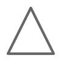

# Chapter 1 - Introduction and overview

## Welcome

### Trainer profile

#### Name, Company / Uni

#### Why i'm here. My motivation.

#### What i've done before.

#### What interests me most.

### Participants backgrounds and motivations

##### Name, Company / Uni

##### Why i'm here. My motivation.

##### What i've done before.

##### What interests me most.

## Course components

### Columms example
::: columns

:::: {.column width=20%}

::::

:::: {.column width=80%}

- Item 1.
- Item 2.
- Item 3.

::::

:::

### Chapters

### Lectures

### Trainings

### Cheat Sheets

### Questions

The questions are meant for re-visiting and remembering a previous chapter. 
They should be a guide for an interactive session between the trainer and the room:
* Trainer: The trainer asks the questions.
* Room: Answers the questions. If no answer can be found, the trainer helps with the answer.  

## Course overview:

### Table of content (Chapter names and short descriptions)

### Schedule for the course

## The Training sessions

### Login at IHP
- Onboarding for everyone to the computers

### Levels
* Success points inbetween lectures
- This is too fast
- This is too slow

### Availablitily GitHub PDF Downloads
- Follow in your own tempo. Get all the data here:
- Link / QR to the course materials

## Open-source EDA for digital designs

### From Design to Microchip

### RTL to GDS - Workflow

### The cheatsheet
First usage of the cheatsheet:

- EDA
- RTL
- GDS II
- ....

### Further topics
* What is the new thing with this course?
* Advantages of open-source in EDA
* The actual state of open-source EDA
* Goals of this course.
* How to participate and interact with this course.
* Producing chips at IHP with the open PDK 

## AMA (Ask me anything)
* Opportunity to ask questions about everything (chapter 1 ?).