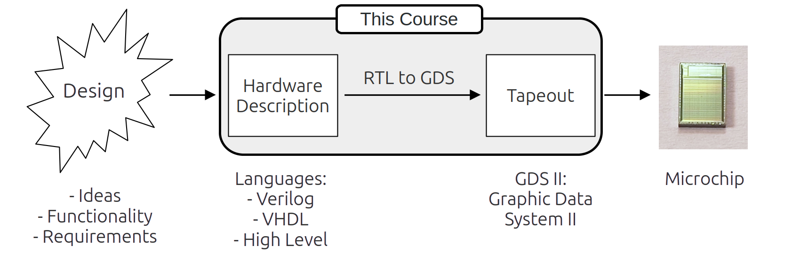

# Chapter 1 - Introduction and overview

## Welcome

### Trainer profile

Me:

##### Name, Company / Uni

##### Why i'm here. My motivation.

##### What i've done before.

##### What interests me most.

### Participants backgrounds and motivations

You:

##### Name, Company / Uni

##### Why i'm here. My motivation.

##### What i've done before.

##### What interests me most.

## Course overview

### Chapter names
 
::: columns

:::: {.column width=50%}

* 01 Introduction

* 02 Workflow

* 03 Design and example pick

* 04 OpenROAD first run

* 05 PDK Examination

::::

:::: {.column width=50%}

* 06 Data in OpenROAD
* 07 LVS and DRC
* 08 Simulation and PPA
* 09 Scripting
* 10 GDS and Tapeout

::::

:::

### Chapter names

::: columns

:::: {.column width=50%}

* 01 Introduction

* 02 Workflow

* 03 Design and example pick

* 04 OpenROAD first run

* 05 PDK Examination

Day 1 - 2

::::

:::: {.column width=50%}

* 06 Data in OpenROAD
* 07 LVS and DRC
* 08 Simulation and PPA
* 09 Scripting
* 10 GDS and Tapeout

Day 3 - 5

::::

:::

### Schedule for the course

## Course components

### Lectures
::: columns

:::: {.column width=15%}

::::

:::: {.column width=15%}

::::

:::: {.column width=70%}
#####
Lectures:

* All the chapters start with a lecture slide deck.
* The trainer will walk you trough the content of the lectures.
* Whenever you have a question inbetween: ask directly.
* The lectures contain the base knowledge of the course.

::::

:::

### Trainings

::: columns

:::: {.column width=10%}

::::

:::: {.column width=10%}

::::

:::: {.column width=80%}
#####
Common training tasks:

Every training sessions starts with the common part. The tasks of the common part are sufficient to follow along the content of the course. If you're a beginner, these trainings should be your goal to reach.

::::

:::

::: columns

:::: {.column width=10%}

::::

:::: {.column width=10%}

::::

:::: {.column width=80%}
#####
Advanced training tasks:

The advanced training sessions are for those With pre knowledge. If the common training was finished fast or was just to easy, the advanced sessions get you convered. 

::::

:::

::: columns

:::: {.column width=10%}

::::

:::: {.column width=10%}

::::

:::: {.column width=80%}
#####
Bonus training tasks:

Still time left to do some tasks? Want something to take with you as homework? Please enjoy the bonus rounds of the training sessions.

::::

:::

### Cheat Sheets

::: columns

:::: {.column width=15%}

::::

:::: {.column width=15%}

::::

:::: {.column width=70%}

Some things are really hard to remember:

* Abbreviations 
* Complex relations and graphics
* EDA tools workflow
* Schedule of the week
* Mathematics (joking, wer're not doing math here)
* ...

::::

:::

#####
 
* That is why we have Cheat Sheets.
* They're made for cheating the hard parts.
* Cheatsheets work best when printed as handouts. 
* You should have them nearby the computer during the course.

### Questions
::: columns

:::: {.column width=15%}

::::

:::: {.column width=85%}

::::

:::

Questions:

* The questions are for re-visiting and remembering a previous chapter. 
* They guide an interactive session between the trainer and the room:
    * Trainer: Asks the questions.
    * Room: Answers the questions. 
        * Skipping a question is fine. 
        * Not knowing the answer is fine.
        * This is not a test nor a challenge.
        * Think of this as a helpfull recap of yesterdays content.
    * If no answer is found, the trainer helps with the answer.

## The Training sessions

### Login at IHP
Now:

- Onboarding to the computers for everyone

### Levels
* Success points inbetween lectures
- This is too fast
- This is too slow

### Availablitily GitHub PDF Downloads
- Follow in your own tempo. Get all the data here:
- Link / QR to the course materials

## Open-source EDA for digital designs

### From Design to Microchip

### RTL to GDS - Workflow

### The cheatsheet
First usage of the cheatsheet:

- EDA
- RTL
- GDS II
- ....

### Further topics
* What is the new thing with this course?
* Advantages of open-source in EDA
* The actual state of open-source EDA
* Goals of this course.
* How to participate and interact with this course.
* Producing chips at IHP with the open PDK 

## AMA (Ask me anything)
* Opportunity to ask questions about everything (chapter 1 ?).