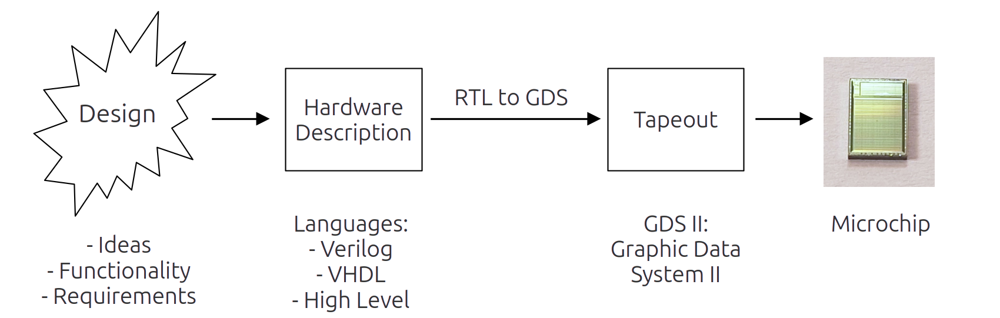

# Chapter 1 - Introduction and overview
## Description
An interactive session for welcoming and warm-up starts the course. The participants and the trainer get to know each other. The first lecture is an introduction to the course, followed by an overview of the contents. The course schedule gets explained including the mix of lecture-, training- and question-units.

## Welcoming:
* Trainer profile
* Participants backgrounds and motivations

## Columms example
::: columns

:::: {.column width=20%}

::::

:::: {.column width=80%}

- Item 1.
- Item 2.
- Item 3.

::::

:::

## Course components
### Chapters

### Lectures

### Trainings

### Cheat Sheets

### Questions

The questions are meant for re-visiting and remembering a previous chapter. 
They should be a guide for an interactive session between the trainer and the room:
* Trainer: The trainer asks the questions.
* Room: Answers the questions. If no answer can be found, the trainer helps with the answer.  

## Overview of the course:
* Table of content (Chapter names and short descriptions)
* Schedule for the course

## The Trainings
* Success points inbetween lectures
- This is too fast
- This is too slow

## Login at IHP
- Onboarding for everyone to the computers

## Availablitily GitHub PDF Downloads
- Link / QR to the course materials

## Introduction to open-source EDA and the course, addressing the following topics:

* What is the new thing with this course?
* Advantages of open-source in EDA
* The actual state of open-source EDA
* Goals of this course.
* How to participate and interact with this course.
* Producing chips at IHP with the open PDK 

## Questions from the participants
* Opportunity to ask questions about chapter 1.