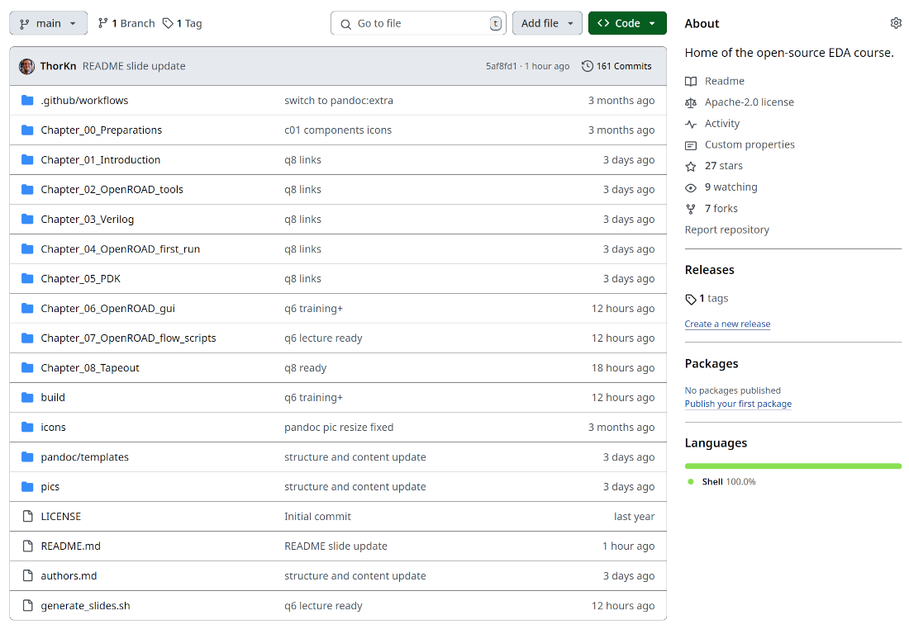

# Chapter 01 - Server, Login, Shell - TRAINING - Common

## Server and user credentials

The PC environment for the course will be provied by IHP.

- Your PC in front of you must be connected to a server
- You will then work in a Ubuntu 24 Linux system
- The desktop GUI will be Gnome

### Connect to the IHP server

##### Follow these steps:

1. Open ThinLinc on the host PC (Windows?)
2. Connect with the login data, given to you by IHP
3. Ubuntu with Gnome desktop should start in ThinLinc
4. Make it fullscreen
5. "Forget about the host system?"

##### Notice:

- Please ask if there is questions!
- We`ll try to do this for all participants first, before proceeding to the next steps of the training.

## GNOME desktop: First lookaround

### Search, start and close programs

##### Create and save a textfile:

1. Search for a texteditor (gedit)
2. Open gedit
3. Write a litte (your name or anything else)
4. Save the textfile with a name and the suffix .txt
5. To a new dirctory: Documents/myfiles
6. Close the texteditor (gedit)

### Tab-switching between programs

##### Tab-switch between opened programs:

1. Search and open at least three different programs (office, gedit, document viewer?)
2. Tab between the programs (with ALT+TAB on the keyboard)
3. It is a circle. After three Tabs you should be at the first again.
4. Close all programs

## The course data

### Download and unpack

#### Get the course data

- Get the latest release download package:

[https://github.com/OS-EDA/Course/releases](https://github.com/OS-EDA/Course/releases)

- Create a directory for the course slides.
- In Linux the ~/Documents is a good place to create the directory. Maybe create the directory Documents/course
- Unpack the course into this directory.

### Look around in the course data



### The chapters and slides

You will find the slides in the ```build``` dirctory.

- If sorted alphabetical, it makes most sense.
- C0X is the chapter number.
- In each chapter:
    * Start with the lecture
    * Cheasheet (if available) is a single slide
    * Trainnings in the order commcon, advanced and bonus
    * Questions are for the next day (mornings)

##### Task:

- Examine the ```build``` directory. 
- Open and close some of the pdf files.
- Become comfortable with the course structure.

### Links from the slides

#####
This might be outdated for the course, please try yourself.

- An issue with the linux document viewer and snap browsers.
- Links from slides don't open in the browser.

Possible workaround:

- Right click the link and copy
- Open browser
- Paste link to URL line

### Workspace arrangement

Suggestions or Options:

- Arrange windows next to each other
- ALT+TAB between programs (tasks)
- Close unwanted windows after the completion of a chapter

## Linux shell

### Short commandl ist of a linux shell

- ```ls``` (list content of directory)
- ```ls -al``` (list with option for more information)
- ```cd``` directoryname (change to directory)
- ```cd ..``` (change to upper directory)
- ```mkdir``` (make directory)
- ```touch``` (make file)
- ```mv``` (move)
- ```cp``` (copy)
- ```nano``` (opens the nano file editor)

### Man pages

If unsure how to use a command, read the man-page:

```
man <command>
```

##### Task:

- Open the man pages of all the commands in the above list (last slide)
- Find the syntax for the commands (it is given on the top of the man page)
- What are ```OPTION```, ```SOURCE``` and ```DEST``` ? 
- Find the definition of the option ```-al``` for the command ```ls```

### IMPORTANT: Setup the environment

To get ready for working with the open-source EDA tools, you must run (execute) a shell script in your shell terminal.

**This is aboslutly neccessary for the rest of the course**

**This must be done every time you open a shell and want to work with the tools**

##### Task: Setup the linux tool environment 

- Open a shell terminal
- Run ```source /eda/or/env.sh```
- Do this every time you open a new shell.
- It doesn't hurt of you do it multiple times. Nothing breaks.
- It will lead to strange behaviour and not results if it is not done.

##### 

You should get a message like ```copied flow directory``` or ```flow directory already there```

### IMPORTANT: Check the environment

- Check if the setup was successfull.
- **Don't continue if the checks are errornous, but ask for help from the trainer**

##### Task: Check the environment
- Open a shell terminal
- Run ```source /eda/or/env.sh```
- See if the tools are sourced (available) with getting their versions:
    * ```openroad -version``` should give your the version number
    * ```yosys --version``` should give you the version number
    * ```klayout -v``` should give you the version number

### Congratulations!

**Congratulations:**

**You have succesfully run some of the open-source EDA tools on a linux server.**

- You did run openroad, yosys and klayout.
- They did not do much, but giving you their version numbers.
- But it is the needed base for the rest of the course.

**You are on a good way**

### Online shell tutorial

To learn some Linux shell, you should find a tutorial that matches good to you. 

I found this one simple and good to follow for me while learning Linux shell:

[https://community.linuxmint.com/tutorial/view/100](https://community.linuxmint.com/tutorial/view/100)

### Makefile

OpenROAD flow scripts use Makefiles. So you might want to learn some basics about Makefiles.

Again here is the tutorial that has helped me most:

[https://makefiletutorial.com/](https://makefiletutorial.com/)

### Tips and tricks

- shell: TAB for autocompletion
- shell: 2xTAB for all choices of autocompletion
- Open a new shell terminal with the mouse:
    * Right click on an empty space in the directory window
    * Choose "open in Terminal"

