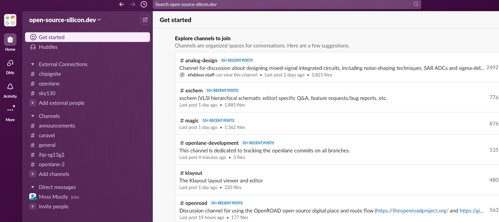

# Chapter 2 - OpenROAD workflow 

## History of OpenROAD

### Foundations and Realization of Open, Accessible Design (OpenROAD)

At the top of the documentation:

[https://openroad-flow-scripts.readthedocs.io](https://openroad-flow-scripts.readthedocs.io)

![Darpa IDEA [^1]](pics_lecture/history_openroad_docs_1.png "Darpa IDEA")

[^1]: Source: Screenshot of the webpage.

### Darpa IDEA

[https://www.darpa.mil/research/programs/intelligent-design-of-electronic-assets](https://www.darpa.mil/research/programs/intelligent-design-of-electronic-assets)

![Darpa IDEA [^1]](pics_lecture/history_darpa_idea.png "Darpa IDEA")

[^1]: Source: Screenshot of the webpage.

### Darpa ERI

2018/2019
Darpa ERI, cadence and the people

[https://community.cadence.com/tags/openroad](https://community.cadence.com/tags/openroad)

Start reading from the bottom!

![Darpa ERI [^1]](pics_lecture/history_darpa.png "Darpa ERI Blog")

[^1]: Source: Screenshot of the webpage.

### OpenROAD V1.0

Document with OpenROAD V1.0 Expectations:

[https://vlsicad.ucsd.edu/NEWS19/OpenROAD%20RTL-to-GDS%20v1.0%20Expectations.pdf](https://vlsicad.ucsd.edu/NEWS19/OpenROAD%20RTL-to-GDS%20v1.0%20Expectations.pdf)

![OpenROAD v1.0 [^1]](pics_lecture/history_or_1.png "OpenROAD v1.0")

[^1]: Source: Screenshot of the webpage.

### V1.0 Roadmap 

How to deal with these expectations:

[https://eri-summit.darpa.mil/docs/ERIsummit2019/posh/08IDEA%20UCSD%20Website.pdf](https://eri-summit.darpa.mil/docs/ERIsummit2019/posh/08IDEA%20UCSD%20Website.pdf)

![Looking forward [^1]](pics_lecture/history_looking_forward.png "Looking forward")

[^1]: Source: OpenROAD presentation at DARPA ERI.

### Courses for OpenROAD

A single excellent project (some of us might know):

[https://theopenroadproject.org/Courses/](https://theopenroadproject.org/Courses/)

![Courses [^1]](pics_lecture/openroad_courses.png "OpenROAD Courses")

[^1]: Source: Screenshot of the webpage.

### Help is on the way

Kudos to this course:

[https://theopenroadproject.org/news/6455/](https://theopenroadproject.org/news/6455/)

![This course [^1]](pics_lecture/eda_course.png "This course")

[^1]: Source: Screenshot of the webpage.

## OpenROAD Flow Scripts

### Flow steps

![OpenROAD flow steps [^1]](pics_lecture/flow_01.png "OpenROAD flow steps")

[^1]: Source: OpenROAD documentation.

### Flow components

![OpenROAD flow components [^1]](pics_lecture/flow_02.png "OpenROAD flow components")

[^1]: Source: OpenROAD documentation.

### Help with the terminology

Searching the terms with a standard search engine might not bring usefull results every time.
Matt Venn created a page for EDA terminology:

[https://www.zerotoasiccourse.com/terminology/](https://www.zerotoasiccourse.com/terminology/)

![Zero to Asic Terminology [^1]](pics_lecture/za_terminology.png "Zero to ASIC Terminology page")

[^1]: Source: Screenshot of the webpage.

### Resources list

Awesome open-source asic resources:

[https://github.com/mattvenn/awesome-opensource-asic-resources](https://github.com/mattvenn/awesome-opensource-asic-resources)

Zero-to-ASIC resources list:

[https://www.zerotoasiccourse.com/resources/](https://www.zerotoasiccourse.com/resources/)

AIC 2025 lectures by Carsten Wullf:

[https://github.com/wulffern/aic2025](https://github.com/wulffern/aic2025)

[https://analogicus.com/aic2025/](https://analogicus.com/aic2025/)

### The list of open-source tools

The list of flow steps and flow components in ORFS contains the information about the original open-source tools.

We will dive a little deeper into this list with the course training:

[https://openroad-flow-scripts.readthedocs.io/en/latest/tutorials/FlowTutorial.html#running-the-automated-rtl-to-gds-flow](https://openroad-flow-scripts.readthedocs.io/en/latest/tutorials/FlowTutorial.html#running-the-automated-rtl-to-gds-flow)

### Meet the developers

There is a slack community with most of the open-source silicon projects and people in it:

[https://open-source-silicon.dev](https://open-source-silicon.dev)

This is the perfect place, if you 

- search for people you heard of in open-source EDA.
- want to reach out to tool developers.
- have all sorts of questions in open-source EDA.
- look for a specific problem and want to see if others already are in a discussion about it.
- want to share your experience and help others.

### 

Most of the tools in open-source EDA have their own channel in this slack. Just try search and add for the channel names.

