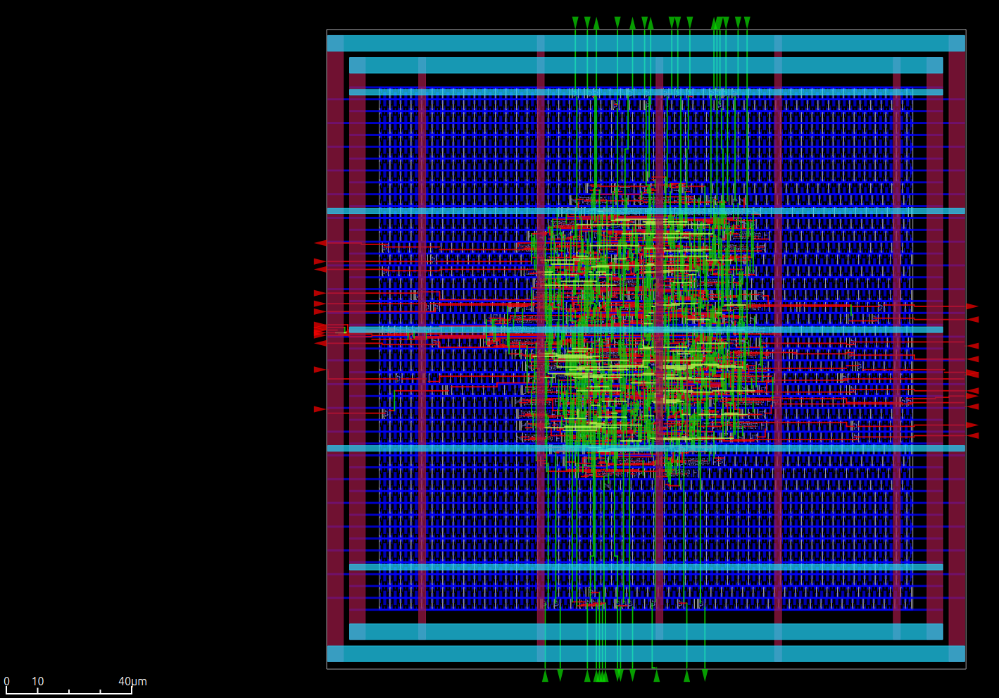
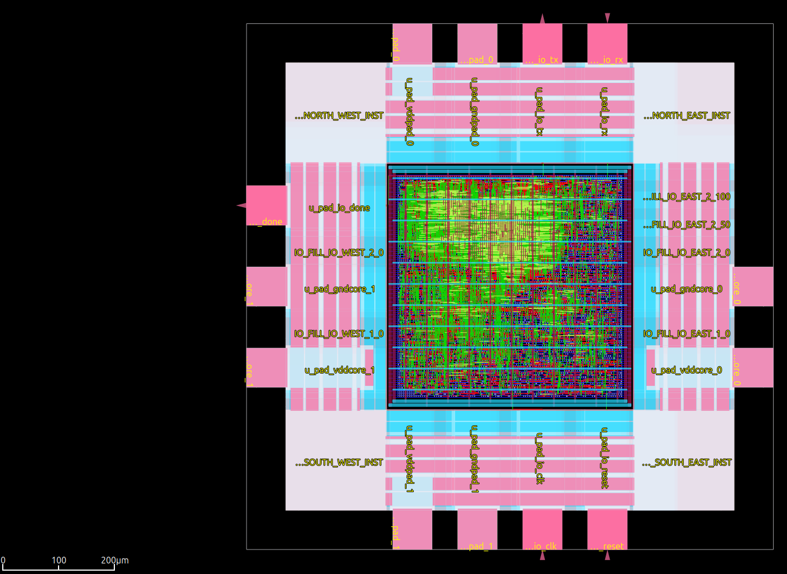

# Examples
## Openroad GUI
```
openroad -gui
```

### Example: gcd (from the OpenROAD-flow-script examples)


### Example: masked_aes (from the Sign:HEP research project)
[HEP Alliance - Masked AES](https://github.com/HEP-Alliance/masked-aes-tapeout)

