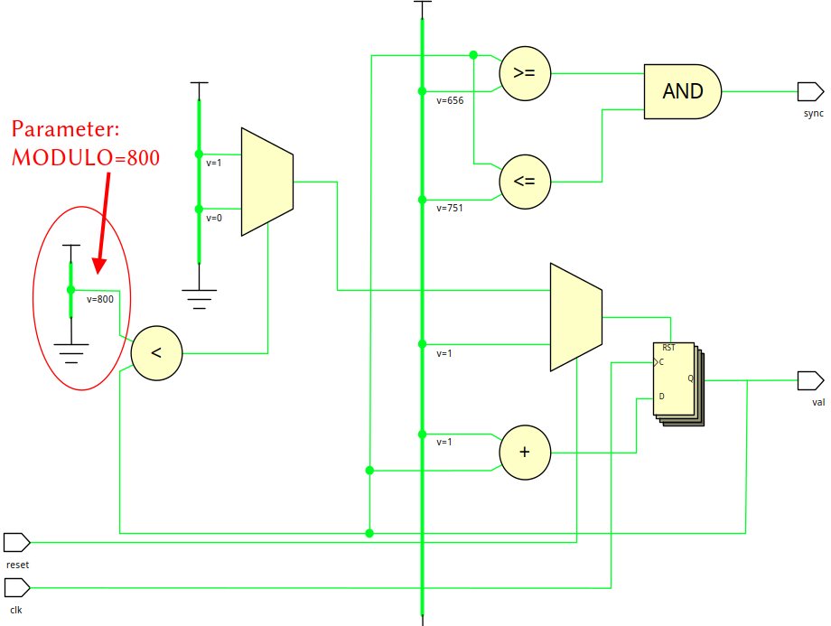

# Chapter 3 - Verilog crash course

## Introduction

Verilog was initially developed as a simulation language in 1983/1984, bought up by Cadence and freely released in 1990.

The first standardization took place in 1995 by the IEEE (Verilog 95). A newer version is IEEE Standard 1364-2001 (Verilog 2001).

* Syntax comparable to C (VHDL was started on ADA / Pascal) with compact code
* Spread in North America and Japan (less in Europe)
* Can also be used as the language for netlists
* Support from open source tools
* The majority of the ASICs are developed in Verilog.
* Less expressive than VHDL (curse and blessing)

###
The proximity to C and Java may lead to confusion. In Verilog, too, lines that describe a combinatorial circuit can also be replaced.

** Verilog is a hardware description language (HDL)**

This crash course is limited to a subset of synthesible language constructs in Verilog.

The aim of this selection is not commercial tools, but open-source development tools such as OpenRoad [^1] or Toolchains for FPGAS, i.e. we also use some language constructs from Systemverilog, which are supported by the Yosys synthesis tool.

[^1]: [https://theopenroadproject.org/](https://theopenroadproject.org/)

###

##### Literature

* Donald E. Thomas, Philip R. Moorby, The Verilog Hardware Description Language, Kluwer Academic Publishers, 2002, ISBN 978-1475775891 
* Blaine Readler, Verilog by example, Full Arc Press, 2011, ISBN 978-0983497301

### Contributions, mentions and license

* This course is a translated, modified and 'markdownized' version of a Verilog crash course from Steffen Reith, original in german language.

    [https://github.com/SteffenReith](https://github.com/SteffenReith)

* The initial rework (translate, modify and markdownize) was done by:

    [https://github.com/ThorKn](https://github.com/ThorKn)

* The build of the PDF slides is done with pandoc:

    [https://pandoc.org/](https://pandoc.org/)

* Pandoc is wrapped within this project:

    [https://github.com/alexeygumirov/pandoc-beamer-how-to](https://github.com/alexeygumirov/pandoc-beamer-how-to)

* License:

    GPLv3

### Synthesis tool: Yosys

One should also deal with the peculiarities of the synthesis tool. The well-known open source synthesis tool Yosys writes about this

> Yosys is a framework for VerilogRTLsynthesis. It currently has extensive Verilog-2005 support and provides a basic set of synthesis algorithms for various application do mains. Selected features and typical applications:

#####
- Process almost any synthesizable Verilog-2005 design
- Converting Verilog to BLIF / EDIF/ BTOR / SMT-LIB /simple RTL Verilog / etc.
- ...

## Verilog elements

### Structure of a verilog module

```Verilog
module module_name (port_list);
// Definition of the interface
Port declaration
Parameter declaration

// Description of the circuit
Variables declaration
Assignmente
Module instanciations

always-blocks

endmodule
```

Port list and port declaration can be brought together in modern verilog.

// introduces a comment.

### Example: A linear feedback shiftregister
::: columns

:::: column

```{.Verilog .numberLines startFrom="1"}
module LFSR (

input  wire   load,
input  wire   loadIt,
input  wire   enable,
output wire   newBit,
input  wire   clk,
input  wire   reset);

wire       [17:0]   fsRegN;
reg        [17:0]   fsReg;
wire                taps_0, taps_1;
reg                 genBit;

assign taps_0 = fsReg[0];
assign taps_1 = fsReg[11];

always @(*) begin
  genBit = (taps_0 ^ taps_1);
  if(loadIt) begin
    genBit = load;
  end
end
```
::::

:::: column

```{.Verilog .numberLines startFrom="24"}
assign newBit = fsReg[0];
assign fsRegN = {genBit,fsReg[17 : 1]};

always @(posedge clk) begin
  if(reset) begin
    fsReg <= 18'h0;
  end else begin
    if(enable) begin
      fsReg <= fsRegN;
    end
  end
end

endmodule
```
::::

:::

**input** and **output** define the directions of the ports. 

###

This part of the code

```{.Verilog .numberLines startFrom="18"}
always @(*) begin
  genBit = (taps_0 ^ taps_1);
  if(loadIt) begin
    genBit = load;
  end
end
```

becomes this combinational circuit:


### 

And this part of the code

```{.Verilog .numberLines startFrom="18"}
always @(posedge clk) begin
  if(reset) begin
    fsReg <= 18'h0;
  end else begin
    if(enable) begin
      fsReg <= fsRegN;
    end
  end
end
```

becomes a sequential with memory (flip flops) in it. The flip flops will look something like this:


### Constants and Operators

There are four values available for constants and signals:

* 0 / 1
* X or x (unknown)
* Z or Z (high impedance)

One can specify the width of constants:

* Hexadepimal constant with 32 bit: 32'hDEADBEEF
* Binary constant with 4 bit: 4'b1011
* For better readability you can also use underscores: 12'B1010_1111_0001

To specify the number base use

* b (binary)
* h (hexadecimal),
* o (octal)
* d (decimal)

The default is decimal (d) and the bit width is optional, i.e. 4711 is a valid (decimal) constant.

###
There is an array notation:

* wire [7:0] serDat;
* reg [0:32] shiftReg;
* Arrays can be sliced to Bits:
    * serDat[3 : 0] (low-nibble) 
    * serDat[7] (MSB).
* {serDat[7:6], serDat[1:0]} notes the concatenation.
* Bits can be replicated and converted into an array, i.e {8{serData[7 : 4]}} contains eight copies of the high-nibble from serDat and has a width of 32.

Arithmetic operations, relations, equivalences and negation:

* a + b, a - b, a * b, a / b und a % b
* a > b, a <= b, und a >= b
* a == b und a != b,
* !(a = b)

###
** Attention: ** If x or z do occur, the simulator determines false in a comparison. If you want to avoid this, the operators === and !== exist. So the following applies:

::: columns

:::: column
#####
```Verilog
if (4'b110z === 4'b110z)
// not taken
then_statement;
```

::::

:::: column
#####
```Verilog
if (4'b110z == 4'b110z)
// not taken
then_statement;
```

::::

:::

Boolean operations exist as usual:

**bitwise operators:** & (AND), | (OR, ~ (NOT), ^ (XOR) und auch ~^ (XNOR)

**logic operators:** && (AND), || (OR) und ! (NOT)

**Shiftoperations:** a << b (shift a for b positions to the left) und a >> b (shift a for b positions to the right). A negative number b is not permitted, empty spots are filled with 0.

### Parameters (old style)
In order to be able to adapt designs easier, Verilog offers the use of parameters.

```{.Verilog .numberLines startFrom="1"}
module mux (
  in1, in2,
  sel,
  out);
 
  parameter WIDTH = 8;  // Number of bits 

  input  [WIDTH - 1 : 0] in1, in2;
  input sel;
  output [WIDTH - 1 : 0] out;
  
  assign out = sel ? in1 : in2;

endmodule
```

### Instances and structural descriptions
If you describe a circuit through its (internal) structure or if a partial circuit is to be reused, an instance is generated and wired.

::: columns

:::: column
```{.Verilog .numberLines startFrom="1"}
module xor2 (
  input  wire a,
  input  wire b,
  output wire e);
  assign e = a ^ b;
endmodule
```
::::

:::: column
```{.Verilog .numberLines startFrom="1"}
module xor3 (
  input  wire a,
  input  wire b,
  input  wire c,
  output wire e);
  
  wire tmp;
  xor2 xor2_1 // Instance 1
    (
      .a(a),
      .b(b),
      .e(tmp)
    );
  xor2 xor2_2 // Instance 2
    (
      .a(c),
      .b(tmp),
      .e(e)
    );
    
endmodule
```
::::

:::

### Code for sequential circuits
A flip-flop takes over the input of the rising or falling edges of the clock. For this, the block entry is used with the *@-symbol* and *always* blocks:

```{.Verilog .numberLines startFrom="1"}
module FF (input  clk,
           input  rst,
           input  d,
           output q);
  reg q;

  always @ ( posedge clk or 
             posedge reset)
    begin
      if ( rst )
        q <= 1'b0;
      else
        q <= d;
     end 
endmodule
```
The list of signals after the @-symbol means sensitivity list. The reset is synchronized when you remove *or posedge reset*.

## Simple circuits: Combinational

###
Combinational circuits correspond to pure boolean functions and therefore do not contain the key word *reg*. No memory (flip-flops) gets generated and assignments are done with *assign*.

```{.Verilog .numberLines startFrom="1"}
module mux4to1 (in1, in2, in3, in4, sel, out);

  parameter WIDTH = 8; 

  input [WIDTH - 1 : 0] in1, in2, in3, in4;
  input [1:0] sel;
  output [WIDTH - 1 : 0] out;

  assign out = (sel == 2'b00) ? in1 :
               (sel == 2'b01) ? in2 :
               (sel == 2'b10) ? in3 :
               in4;
endmodule
```

### Priority encoder
Similarly to the VHDL version, we describe the priority encoder as follows:

```{.Verilog .numberLines startFrom="1"}
module prienc (input  wire [4 : 1] req, 
               output wire [2 : 0] idx);

   assign idx = (req[4] == 1'b1) ? 3'b100 :
                (req[3] == 1'b1) ? 3'b011 :
                (req[2] == 1'b1) ? 3'b010 :
                (req[1] == 1'b1) ? 3'b001 :
                3'b000;

endmodule
```

### Priority encoder (alternative version)
For a priority encoder you can use the *don't care* feature from Verilog.

```{.Verilog .numberLines startFrom="1"}
module prienc (input  [4:1] req,
               output reg [2:0] idx);

  always @(*) begin
    casez (req) // casez allows don't-care
       4'b1???: idx = 3'b100; // Also: idx = 4;
       4'b01??: idx = 3'b011;
       4'b001?: idx = 3'b010;
       4'b0001: idx = 3'b001;
       default: idx = 3'b000;
    endcase
  end

endmodule
```

## Simple circuits: Sequential

### Synchronous design
Contrary to combinational circuits, sequential circuits use internal memory, i.e. the output not only depends on the input.

In the synchronous method, all memory elements are checked / synchronized by a global clock. All calculations are carried out on the rising (and/or) falling edge of the clock.

The synchronous design enables the draft, test and the synthesis of large circuits with market tools. For this reason, it is advisable to remember this design principle.

Furthermore, there should be no (combinational) logic in the clock path, as this can lead to problems with the distribution times of the clock signals.

### Synchronous circuits
The structure of synchronous circuits is idealized as follows:


### A binary counter
According to the synchronous design, a free running binary counter can be realized:

```{.Verilog .numberLines startFrom="1"}
module freecnt (value, clk, reset);

  parameter WIDTH = 8;

  input  wire clk;
  input  wire reset;
  output wire [WIDTH - 1 : 0] value;

  wire [WIDTH - 1 : 0] valN;
  reg  [WIDTH - 1 : 0] val;

  always @(posedge clk) begin

   if (reset) begin // Synchron reset
     val <= {WIDTH{1'b0}};
   end else begin
     val <= valN;
   end

  end

  assign valN = val + 1; // Nextstate logic
  assign value = val; // Output logic
endmodule
```

### Synthesis result of the binary counter


At this point you can see that the result follows the diagram of the synchronous design.

*RTL_REG_SYNC* corresponds to the stateregister and *RTL_ADD* corresponds to the next state logic.

### Some remarks
So far we use three assignment operators:

* assign signal0 = value
* signal2 <= value 
* signal1 = value

The *assign* instructions is known as the continuous assignment and corresponds (roughly) to an ever active wire connection. It is used for signals of the type *wire* and is not permitted for *reg* (register).

The operator <= means non-blocking assignment. This assignment is used for synthesized registers, i.e. in *always*-blocks with *posedge clk* in the sensitivity list.

The variant = is called blocking assignment and is used for combinational *always*-blocks. Attention: Not allowed for signals of the type *wire*. So use the type *reg*.

### A modulo counter
According to the synchronous design, a freely running modulo counter can be realized:

::: columns

:::: column

```{.Verilog .numberLines startFrom="1"}
module modcnt (value, clk, reset, sync);

  parameter WIDTH  = 10,
            MODULO = 800,
            hsMin  = 656,
            hsMax  = 751;

  input  wire clk;
  input  wire reset;
  output wire [WIDTH - 1 : 0] value;
  output wire sync;

  wire [WIDTH - 1 : 0] valN;
  reg  [WIDTH - 1 : 0] val;
```
::::

:::: column

```{.Verilog .numberLines startFrom="15"}
  always @(posedge clk) begin
   
    if (reset) begin // Synchron reset
      val <= {WIDTH{1'b0}};
    end else begin
      val <= valN;
    end
  
  end

  // Nextstate logic
  assign valN = (val < MODULO) ? val + 1 : 0;

  // Output logic
  assign value = val;
  assign sync = ((val >= hsMin) && (val <= hsMax)) ? 1 : 0;

endmodule
```

::::

:::

### Synthesis result of the modulo counter

In this case, next state logic and output logic are of course  more complex:



### A register file
RISC-V processors have a register file with a special zero register. Reading always provides 0 and writing operations are ignored.

```{.Verilog .numberLines startFrom="1"}
module regfile (input clk,
                input [4:0] writeAdr, input [31 : 0] dataIn,
                input wrEn,
                input [4:0] readAdrA, output reg [31:0] dataOutA,
                input [4:0] readAdrB, output reg [31:0] dataOutB);

  reg [31 : 0] memory [1 : 31];

  always @(posedge clk) begin

    if ((wrEn) && (writeAdr != 0)) begin

      memory[writeAdr] <= dataIn;

    end

    dataOutA <= (readAdrA == 0) ? 0 : memory[readAdrA];
    dataOutB <= (readAdrB == 0) ? 0 : memory[readAdrB];

  end

endmodule
```

## Selected feature: Parameterized counter
The newer variants of Verilog offer an improved version of the parameter feature:

::: columns
:::: column
```{.Verilog .numberLines startFrom="1"}
module cnt
  #(parameter N = 8,
    parameter DOWN = 0)

   (input clk,
    input resetN,
    input enable,
    output reg [N-1:0] out);

    always @ (posedge clk) begin
    
     if (!resetN) begin // Synchron
       out <= 0;
     end else begin
     if (enable)
       if (DOWN)
        out <= out - 1;
      else
        out <= out + 1;
     else
       out <= out;
     end
     
    end

endmodule
```
::::

:::: column
```{.Verilog .numberLines startFrom="1"}
module doubleSum
  #(parameter N = 8)
   (input clk,
    input resetN,
    input enable,
    output [N  :  0] sum);

  wire [N - 1  :  0] val0;
  wire [N - 1  :  0] val1;

  // Counter 0
  cnt #(.N(N), .DOWN(0)) c0 (.clk(clk),
                             .resetN(resetN),
                             .enable(enable),
                             .out(val0));

  // Counter 1
  cnt #(.N(N), .DOWN(1)) c1 (.clk(clk),
                             .resetN(resetN),
                             .enable(enable),
                             .out(val1));

  assign sum = val0 + val1;

endmodule
```
::::
:::

### Synthesis result of the parameterized counter


### An alternative version
Verilog still offers a (older) possibility for the parameterization of a design:

::: columns
:::: column
```{.Verilog .numberLines startFrom="1"}
module double
  #(parameter N = 8)
  (input clk,
   input resetN,
   input enable,
   output [N : 0] sum);

  wire [N - 1 : 0] val0;
  wire [N - 1 : 0] val1;

  // Counter 0
  defparam c0.N = N;
  defparam c0.DOWN = 0;
  cnt c0 (.clk(clk),
          .resetN(resetN),
          .enable(enable),
          .out(val0));
```
::::

:::: column
```{.Verilog .numberLines startFrom="18"}
  // Counter 1
  defparam c1.N = N;
  defparam c1.DOWN = 1;
  cnt c1 (.clk(clk),
          .resetN(resetN),
          .enable(enable),
          .out(val1));

  assign sum = val0 + val1;

endmodule
```
::::
:::

This variant leads to the same synthesis result.

## Selected feature: Preprocessor
Verilog knows a preprocessor (cf. C/C ++) with \`define, \`include and \`ifdef. A *parameter* defines a constant and \`define a text substitution.

```Verilog
`define SHIFT_RIGHT
module defineDemo (input clk, s_in,
                   output s_out);
  
  reg [3:0] regs;

  always @(posedge clk) begin // next state logic in always-block
    `ifdef SHIFT_RIGHT
      regs <= {s_in, regs[3:1]};
    `else
      regs <= {regs[2:0], s_in};
    `endif
  end

  `ifdef SHIFT_RIGHT
    assign s_out = regs[0];
  `else
    assign s_out = regs[3];
  `endif

endmodule
```

### Two results of the synthesis
The conditional synthesis gives you two different shift registers:


### Modularisation
Comparable to the include mechanism of C/C ++, Verilog offers the possibility of primitive modularization with \`include.

The tick symbol \` is again the marker for a preprocessor command, comparable to # at C/C++.

With \`include headers_def.h, for example, configuration settings from the file headers_def.h can be included. Since a pure text replacement is carried out, the file extension is basically arbitrary. It is meaningfully to use .h analogous to C.

If a \`define is arranged in front of a \`include, the text replacement is also carried out in the included header file, i.e. a \`define applies globally from the definition on. However, this can happen comparable to C unintentionally.

## Selected feature: Yosys and Systemverilog
The open source synthesetool Yosys provides some selected extensions from SystemVerilog.

* The logic datatype is particularly interesting, which simplifies allocations with *reg* and *wire*. With *logic signed* you declare signed numbers.
* The special block *always_ff* was introduced for sequential logic. Only non-blocking assignments (<=) are used for assignments.
* For combinatorial logic, *always_comb* replaces the construct *always @()*. Only blocking assignments (=) are used in *always_comb* blocks.

### Another counter
Now the free running counter is to be re-implemented:

```Verilog
module freecnt2

  #(parameter WIDTH = 8)
  (input  logic clk,
   input  logic reset,
   output logic [WIDTH - 1 : 0] value);

  logic [WIDTH - 1 : 0] valN;
  logic [WIDTH - 1 : 0] val;

  always_ff @(posedge clk) begin

    if (reset) begin // Synchron reset
      val <= {WIDTH{1'b0}};
    end else begin
      val <= valN;
    end

  end

  always_comb begin

    valN  = val + 1; // Nextstate logic
    value = val; // Output logic

  end
endmodule
```

### Blocking and Non-blocking assignments in always_ff
Caution with false assignments in *always_ff*:

::: columns
:::: column
```Verilog
module demoOk (input clk, 
               input d, 
               output q1, 
               output q2, 
               output q3);
  always_ff @(posedge clk) begin
    q1 <= d;
    q2 <= q1;
    q3 <= q2;
  end
endmodule
```
Okay: 
::::

:::: column
``` Verilog
module demoWrong (input clk, 
                  input d, 
                  output q1, 
                  output q2, 
                  output q3);
  always_ff @(posedge clk) begin
    q1 = d;
    q2 = q1;
    q3 = q2;
  end
endmodule
```
Wrong: 
::::
:::


  
