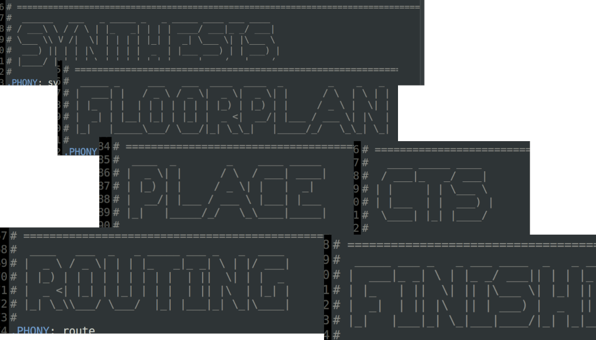
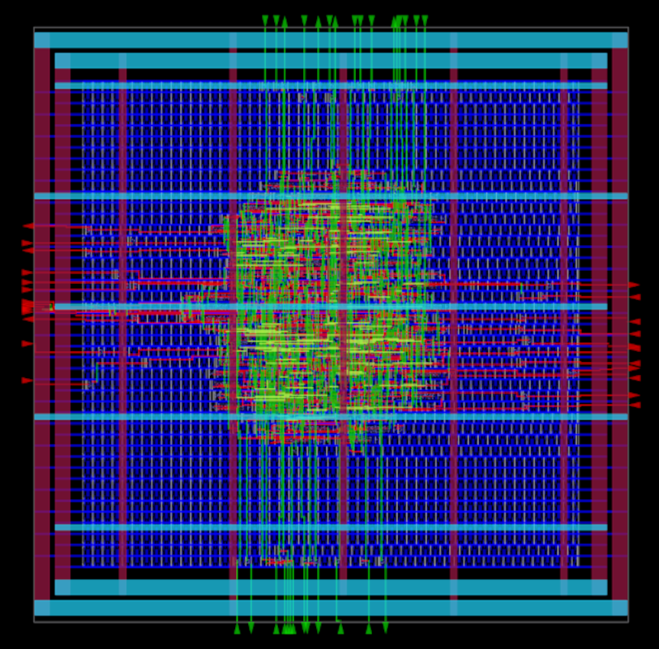
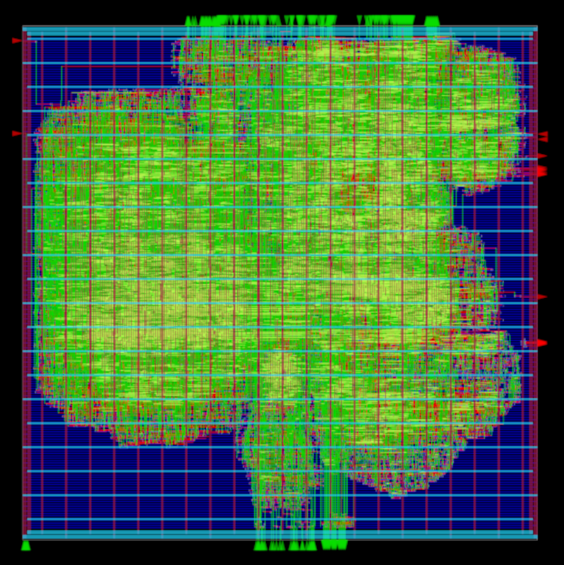
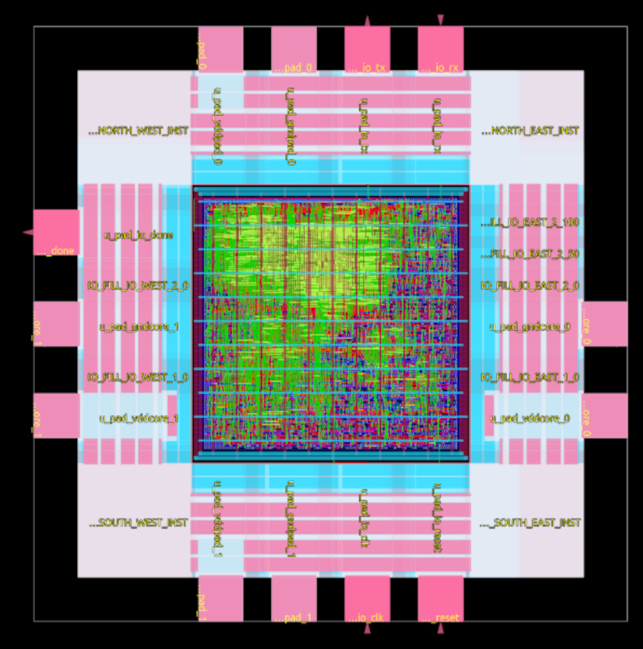
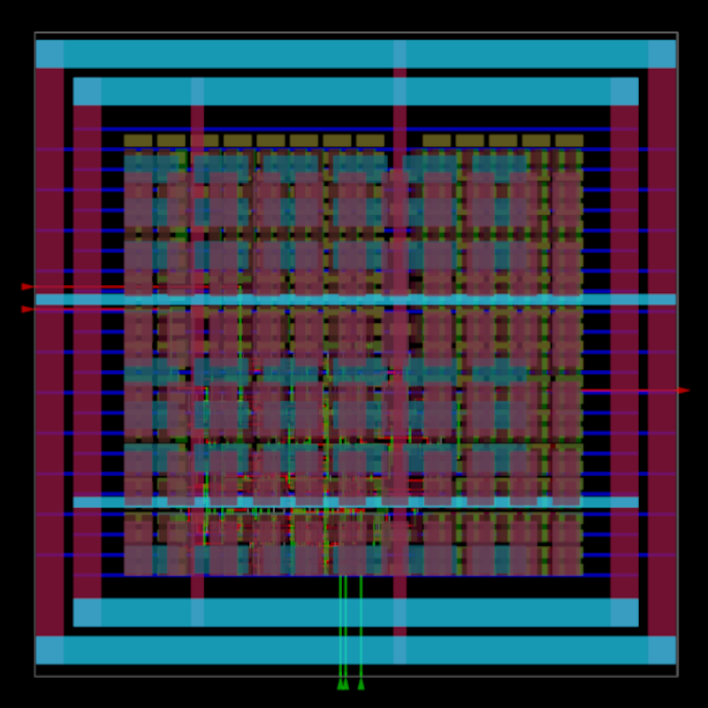
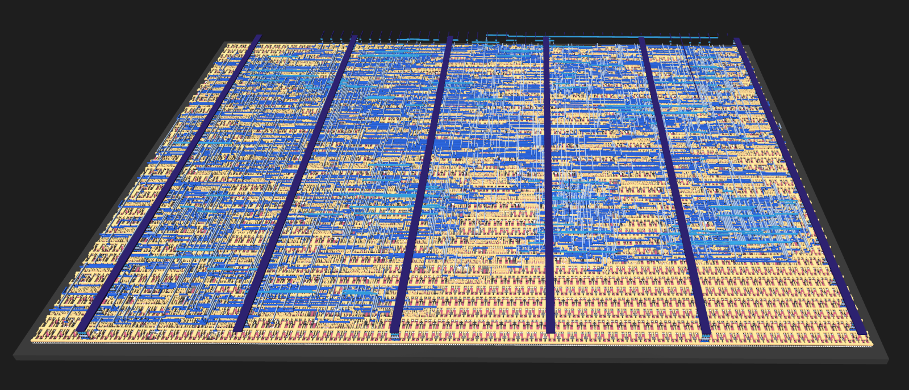

# Chapter 04 - OpenROAD first run

## Doing this chapter

- This chapter is mostly a training.
- We will try to get our first results (GDS files).
- There are example designs avaiable.
- You can start your own design.

## The Makefile

Let's have a look into the Makefile first.

### The flow steps

The Makfile (in the ```/flow``` directory) contains all the flow steps in the same order we already have seen:



### DESIGN_CONFIG

The Makefile starts with the selection of the design to run.

Of interest for this course are the lines regarding to the IHP PDK:

```
#DESIGN_CONFIG=./designs/ihp-sg13g2/aes/config.mk
#DESIGN_CONFIG=./designs/ihp-sg13g2/ibex/config.mk
DESIGN_CONFIG=./designs/ihp-sg13g2/gcd/config.mk
#DESIGN_CONFIG=./designs/ihp-sg13g2/spi/config.mk
#DESIGN_CONFIG=./designs/ihp-sg13g2/riscv32i/config.mk
#DESIGN_CONFIG=./designs/ihp-sg13g2/masked_aes/config.mk
```

The ```gcd``` example is selected for the next run.

## The designs to run 

### gcd (greatest common denominator)

- The gcd design is included with the OpenROAD-flow-script examples.
- It consists of only a single Verilog file, easy to read.
- Should run on the course server in a few minutes.

###



###

gcd files:

```
/src/gcd$ ls 
gcd.v  
README.md
```

```
/ihp-sg13g2/gcd$ ls
autotuner.json  
config.mk               (important)
constraint.sdc          (important)
metadata-base-ok.json  
rules-base.json
```

### ibex: RISC-V core

- The ibex design is included with the OpenROAD-flow-script examples.
- It consists of many Verilog files, not that easy to read.
- A single run might take more then 30 minutes on the course server.

### 



###

ibex files:

```
src/ibex$ ls
ibex_alu.v                 ibex_ex_block.v         ibex_register_file_ff.v      prim_ram_1p.v
ibex_branch_predict.v      ibex_fetch_fifo.v       ibex_register_file_fpga.v    prim_secded_28_22_dec.v
ibex_compressed_decoder.v  ibex_icache.v           ibex_register_file_latch.v   prim_secded_28_22_enc.v
ibex_controller.v          ibex_id_stage.v         ibex_wb_stage.v              prim_secded_39_32_dec.v
ibex_core.v                ibex_if_stage.v         LICENSE                      prim_secded_39_32_enc.v
ibex_counter.v             ibex_load_store_unit.v  prim_badbit_ram_1p.v         prim_secded_72_64_dec.v
ibex_cs_registers.v        ibex_multdiv_fast.v     prim_clock_gating.v          prim_secded_72_64_enc.v
ibex_csr.v                 ibex_multdiv_slow.v     prim_generic_clock_gating.v  prim_xilinx_clock_gating.v
ibex_decoder.v             ibex_pmp.v              prim_generic_ram_1p.v        README.md
ibex_dummy_instr.v         ibex_prefetch_buffer.v  prim_lfsr.v

```

###

```
ihp-sg13g2/ibex$ ls
autotuner.json  
config.mk  
constraint_doe.sdc  
constraint.sdc  
metadata-base-ok.json  
rules-base.json
```

### masked_aes

- The masked_aes design is part of a research project and is available on Github:
    * [HEP Alliance - Masked AES](https://github.com/HEP-Alliance/masked-aes-tapeout)

- It consists of three Verilog files, one of them >2000 lines of code.
- Should run in a few minutes on the course server.

**Special Features:**

- Contains I/O Pads and a Padring
- Has a README that contains the how-to of a sealring
- Has a README that links to the Metall filler script

###



###

masked_aes files:

```
ihp-sg13g2/masked_aes$ ls 
config.mk  
constraint.sdc  
footprint.tcl  
LICENSE  
README.md  
sealring.gds  
src             (src directory!)
```

```
ihp-sg13g2/masked_aes/src$ ls
AES_Masked.v  
AesTb.v  
MaskedAes.v
```

### lfsr

- The lfsr design example must be created from the scratch.
- The Verilog code is available in the lecture slides of chapter 3 and should become a single file.
- The structure of other examples must be copied for this.
- The configuration files must be copied and adapted for this.
- A single run should be very short.

###



### A TinyTapeout design?

- The design example must be created from the scratch.
- The Verilog code is available as open-source via TinyTapeout
- The structure of other examples must be copied for this.
- The configuration files must be copied and adapted for this.
- The run time is unpredicted.

Suggestion:

The VGA clock example from the pictures earlier:
[https://tinytapeout.com/runs/ttihp0p2/tt_um_vga_clock](https://tinytapeout.com/runs/ttihp0p2/tt_um_vga_clock)

### 




