# Chapter 5 - Process Design Kit (PDK)

## What is a PDK? 

### Wikipedia definition
__A process design kit (PDK)__ is a set of files used within the semiconductor industry to model a fabrication process for the design tools used to design an integrated circuit. The PDK is created by the foundry defining a certain technology variation for their processes. ... 

... The designers use the PDK to design, simulate, draw and verify the design before handing the design back to the foundry to produce chips. The data in the PDK is specific to the foundry's process variation and is chosen early in the design process, influenced by the market requirements for the chip. An accurate PDK will increase the chances of first-pass successful silicon.

Source: [https://en.wikipedia.org/wiki/Process_design_kit](https://en.wikipedia.org/wiki/Process_design_kit)

### Open-source viewpoint

- Semicondutcor industry started to integrate open-soruce.
- Open-source PDKs created by Semiconductor Fabs were a "missing link" between:
	* Open-source EDA tools a(RTL-to-GDS) and
	* Microchip production (GDS-to-Chip)
- Since there is open-source PDKs, the growth of the open-source ecosystem is measurable.
- Many of the tools have been the classical "one-person maintainted" open-source projects. It is getting better. 

### In the context of this course

The PDK (ihp-sg13g2) integrates seemless (to the user) into the OpenROAD flow scripts toolchain.

We have seen reference points from the tools onto the PDK in:

- the configuration files
- the structure of the design directories
- some Variables

### Naming

PDKs sometimes are refered to as:

- Process design kits
- Process node
- Technology node
- Technology

## Open-Source PDK and GitHub

### Difference from closed source
With publishing a PDK under a open-source license, the development from there on becomes a worldwide visible joint effort. The number of contributors and authors of the PDK can only increase from here on. 

### Collaborative workflow in GitHub
Some of the main principles of open-source are the permissions to use, study, change and re-distribute the published code and data according to the license. This leads to a open collaboration in which everyone can participate.

GitHub enables a workflow that was designed and build with these principles and opportunities in mind. A good starting point to explore the open collaboration in the IHP PDK are
 
* [Issues (open and closed)](https://github.com/IHP-GmbH/IHP-Open-PDK/issues)
* [Pull requests (open and closed)](https://github.com/IHP-GmbH/IHP-Open-PDK/pulls)

The topics and discussions that you can read and study there will draw a picture of how the process of open collaboration works for the PDK.

### Issues open

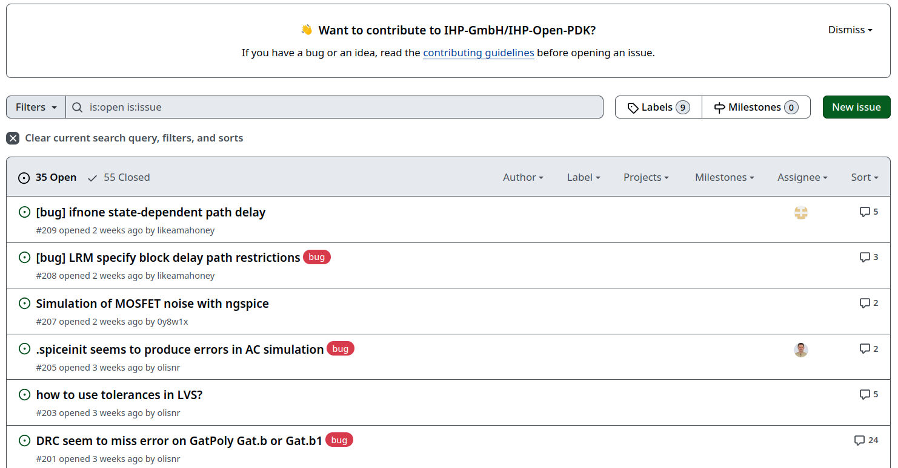

### Issues closed

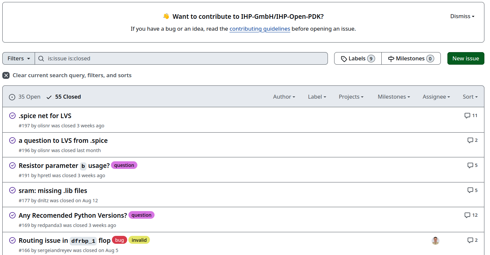

### Pull requests closed

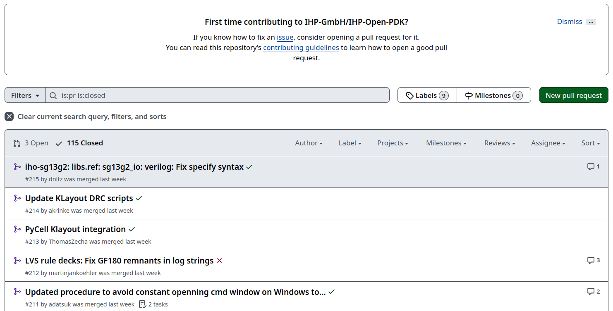

### License file

The IHp open-source PDK is published with an Apache 2.0 license:

[https://github.com/IHP-GmbH/IHP-Open-PDK/blob/main/LICENSE](https://github.com/IHP-GmbH/IHP-Open-PDK/blob/main/LICENSE)

Apache 2.0 is a permissive open-source license. Read more about different open-source licenses here:

[https://choosealicense.com/licenses/](https://choosealicense.com/licenses/)
 
##### 
**Tip:**

Know about the permissions, conditions and limitations of the licenses you are using for your projects! 

## Content of the PDK ihp-sg13g2

### The README
The Readme file in the PDKs repository is the starting point for information about the content of the PDK. 

[https://github.com/IHP-GmbH/IHP-Open-PDK/blob/main/README.md](https://github.com/IHP-GmbH/IHP-Open-PDK/blob/main/README.md)

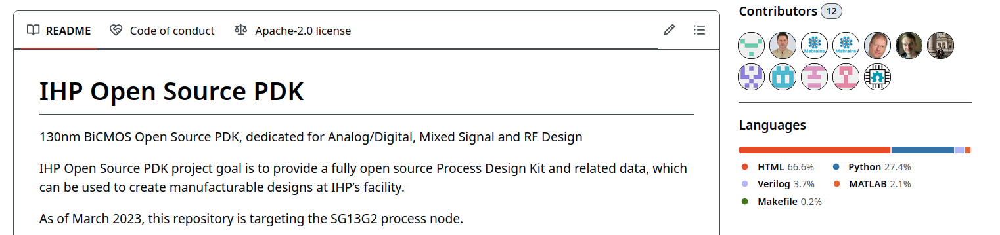

### Project roadmap
A GANTT chart of the roadmap for the open-source PDK is available under this weblink. It shows the projects timeline (2022 - 2026):

[https://github.com/IHP-GmbH/IHP-Open-PDK/blob/main/ihp-sg13g2/libs.doc/roadmap/open_PDK_gantt.png](https://github.com/IHP-GmbH/IHP-Open-PDK/blob/main/ihp-sg13g2/libs.doc/roadmap/open_PDK_gantt.png)

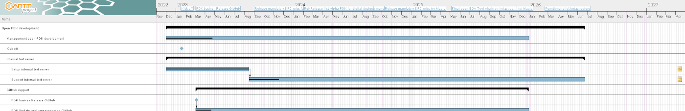

### Tool support

The PDK supports a bunch of tools with the included file formats. A list of the file types and formats follows later in this chapter.

The main tools for this course are 

- OpenROAD flow scripts
- OpenROAD
- KLayout

### 

The list of supported tools from the README in the PDK:

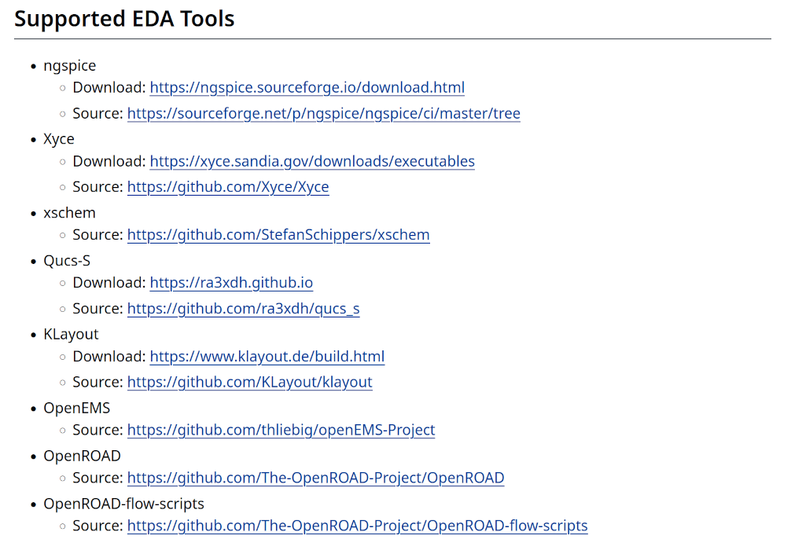

### Cells in the PDK
There are four different sets of cells (or devices) in the PDK:

* Base cellset with limited set of standard logic cells
    * CDL, GDSII, LEF, Tech LEF
    * Liberty, SPICE Netlist, Verilog
* IO cellset
    * GDSII, LEF, Liberty (dummy), SPICE Netlist
* SRAM cellset
    * CDL, GDSII, LEF, Liberty, Verilog
* Primitive devices
    * GDSII


### Other data in the PDK
* KLayout tool data:
    * layer property and tech files
    * DRC rules (minimal set)
    * PyCells
        * initial version of the wrapper API
        * sample cells
* Pcells (for reference only) libs.tech/pycell
* MOS/HBT/Passive device models for ngspice/Xyce
* xschem: primitive device symbols, settings and testbenches
* OpenEMS: tutorials, scripts, documentation
* SG13G2 Process specification & Layout Rules
* MOS/HBT Measurements in MDM format
* Project Roadmap Gantt chart

### Layer stack
IHP sg13g2 Layers in a picture. [Source PDF](https://github.com/IHP-GmbH/IHP-Open-PDK/blob/main/ihp-sg13g2/libs.doc/doc/SG13G2_os_process_spec.pdf)

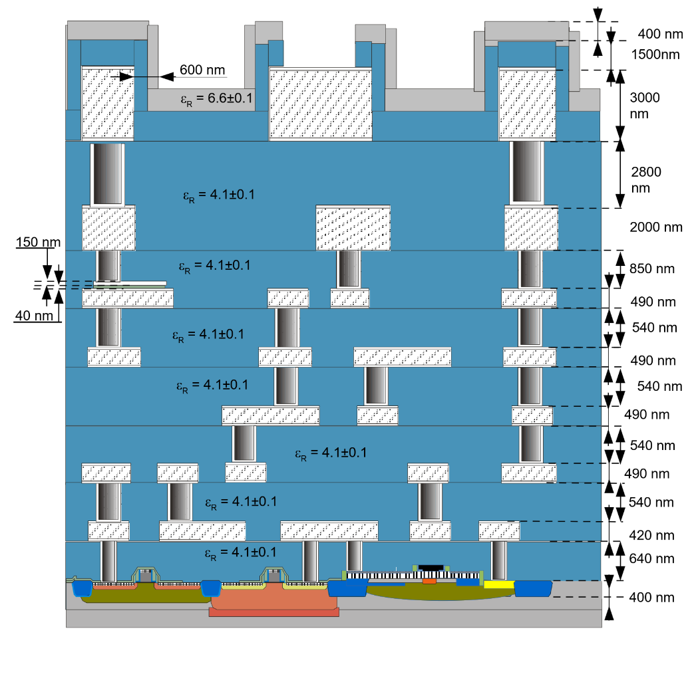

### Design rules 

- The DRC (design rules check) with ORFS happens in KLayout.
- The data for the minimal and maximal checks is here:

[https://github.com/IHP-GmbH/IHP-Open-PDK/tree/main/ihp-sg13g2/libs.tech/klayout/tech/drc](https://github.com/IHP-GmbH/IHP-Open-PDK/tree/main/ihp-sg13g2/libs.tech/klayout/tech/drc)

###

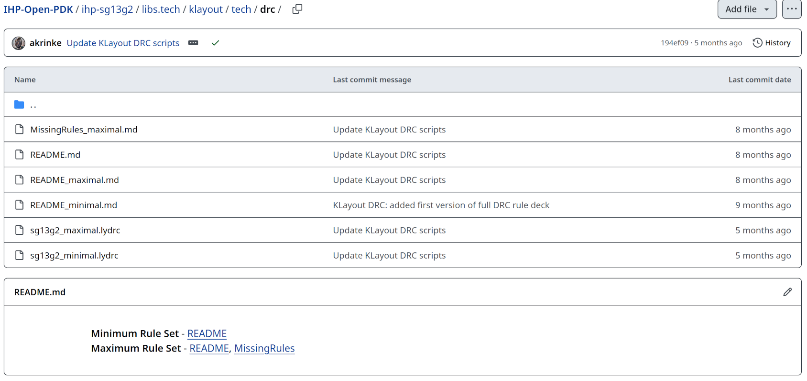

### Layout versus Schematic

- The LVS check with ORFS happens in KLayout.
- The data for the LVS is here:

[https://github.com/IHP-GmbH/IHP-Open-PDK/tree/main/ihp-sg13g2/libs.tech/klayout/tech/lvs](https://github.com/IHP-GmbH/IHP-Open-PDK/tree/main/ihp-sg13g2/libs.tech/klayout/tech/lvs)

###

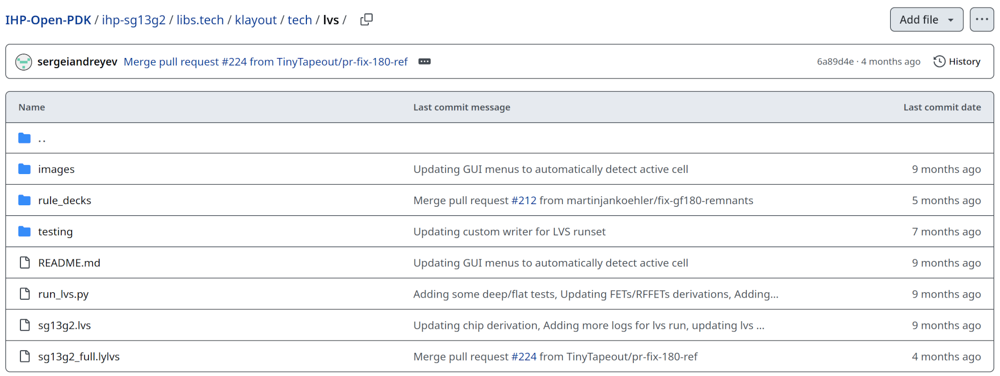

## File formats

### List of file types and formats

::: columns

:::: column


**CDL**: Circuit design language [Link](https://en.wikipedia.org/wiki/Circuit_design_language)

**LEF**: Library Exchange Format [Link](https://en.wikipedia.org/wiki/Library_Exchange_Format)

**TechLEF**: Technology LEF [Link](https://vlsi.pro/technology-lef/)

**GDS II**: Graphic data system II [Link](https://en.wikipedia.org/wiki/GDSII)

**lib**: Liberty timing and power file [Link](https://teamvlsi.com/2020/05/lib-and-lef-file-in-asic-design.html)

**sym**: Symbol file (Xschem) [Link](https://xschem.sourceforge.io/stefan/index.html)

**sch**: Schematic file (Xschem) [Link](https://xschem.sourceforge.io/stefan/index.html)

::::

:::: column

**lyp**: Layer properties file (KLayout) 

**lyt**: Technology mapping file (KLayout)

**lydrc**: DRC rules file (KLayout)

**lylvs**: LVS rule deck (KLayout)

::::

:::


## Example: Cell AO21

### Cell AO21: GDS in KLayout

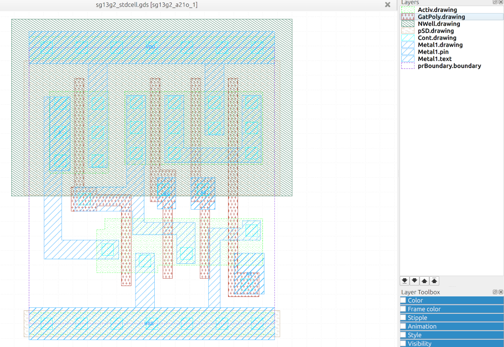

### Cell AO21: VERILOG HDL language
```
// type: AO21 
`timescale 1ns/10ps
`celldefine
module sg13g2_a21o_1 (X, A1, A2, B1);
	output X;
	input A1, A2, B1;

	// Function
	wire int_fwire_0;

	and (int_fwire_0, A1, A2);
	or (X, int_fwire_0, B1);

	// Timing
	specify
		(A1 => X) = 0;
		(A2 => X) = 0;
		if (A1 == 1'b1 & A2 == 1'b0)
			(B1 => X) = 0;
		if (A1 == 1'b0 & A2 == 1'b1)
			(B1 => X) = 0;
		ifnone (B1 => X) = 0;
	endspecify
endmodule
`endcelldefine
```

### Cell AO21: SPICE Netlist
```
* Library name: sg13g2_stdcell
* Cell name: sg13g2_a21o_1
* View name: schematic
* Inherited view list: spectre cmos_sch cmos.sch schematic veriloga ahdl
* pspice dspf
.subckt sg13g2_a21o_1 A1 A2 B1 VDD VSS X
XN0 net1 A1 net2 VSS sg13_lv_nmos w=640.00n l=130.00n ng=1 ad=0 as=0 pd=0 ps=0 m=1
XN1 net2 A2 VSS VSS sg13_lv_nmos w=640.00n l=130.00n ng=1 ad=0 as=0 pd=0 ps=0 m=1
XN2 net1 B1 VSS VSS sg13_lv_nmos w=640.00n l=130.00n ng=1 ad=0 as=0 pd=0 ps=0 m=1
XN3 X net1 VSS VSS sg13_lv_nmos w=740.00n l=130.00n ng=1 ad=0 as=0 pd=0 ps=0 m=1
XP0 net1 B1 net3 VDD sg13_lv_pmos w=1.000u l=130.00n ng=1 ad=0 as=0 pd=0 ps=0 m=1
XP1 net3 A1 VDD VDD sg13_lv_pmos w=1.000u l=130.00n ng=1 ad=0 as=0 pd=0 ps=0 m=1
XP2 net3 A2 VDD VDD sg13_lv_pmos w=1.000u l=130.00n ng=1 ad=0 as=0 pd=0 ps=0 m=1
XP3 X net1 VDD VDD sg13_lv_pmos w=1.12u l=130.00n ng=1 ad=0 as=0 pd=0 ps=0 m=1
.ends
* End of subcircuit definition.
```

### Cell AO21: Circuit design language
```
************************************************************************
* Library Name: sg13g2_stdcell
* Cell Name:    sg13g2_a21o_1
* View Name:    schematic
************************************************************************

.SUBCKT sg13g2_a21o_1 A1 A2 B1 VDD VSS X
*.PININFO A1:I A2:I B1:I X:O VDD:B VSS:B
MN0 net1 A1 net2 VSS sg13_lv_nmos m=1 w=640.00n l=130.00n ng=1
MN1 net2 A2 VSS VSS sg13_lv_nmos m=1 w=640.00n l=130.00n ng=1
MN2 net1 B1 VSS VSS sg13_lv_nmos m=1 w=640.00n l=130.00n ng=1
MN3 X net1 VSS VSS sg13_lv_nmos m=1 w=740.00n l=130.00n ng=1
MP0 net1 B1 net3 VDD sg13_lv_pmos m=1 w=1.000u l=130.00n ng=1
MP1 net3 A1 VDD VDD sg13_lv_pmos m=1 w=1.000u l=130.00n ng=1
MP2 net3 A2 VDD VDD sg13_lv_pmos m=1 w=1.000u l=130.00n ng=1
MP3 X net1 VDD VDD sg13_lv_pmos m=1 w=1.12u l=130.00n ng=1
.ENDS
```

### Cell AO21: LEF

```
MACRO sg13g2_a21o_1
  CLASS CORE ;
  ORIGIN 0 0 ;
  FOREIGN sg13g2_a21o_1 0 0 ;
  SIZE 3.36 BY 3.78 ;
  SYMMETRY X Y ;
  SITE CoreSite ;
  PIN A2
    DIRECTION INPUT ;
    USE SIGNAL ;
    ANTENNAMODEL OXIDE1 ;
      ANTENNAGATEAREA 0.2132 LAYER Metal1 ;
    PORT
      LAYER Metal1 ;
        RECT 2.81 0.405 3.215 0.965 ;
    END
  END A2
  PIN A1
    DIRECTION INPUT ;
    USE SIGNAL ;
    ANTENNAMODEL OXIDE1 ;
      ANTENNAGATEAREA 0.2132 LAYER Metal1 ;
    PORT
      LAYER Metal1 ;
        RECT 2.215 1.565 2.545 2 ;
    END
  END A1
  PIN B1
    DIRECTION INPUT ;
    USE SIGNAL ;
    ANTENNAMODEL OXIDE1 ;
      ANTENNAGATEAREA 0.2132 LAYER Metal1 ;
    PORT
      LAYER Metal1 ;
        RECT 1.755 1.57 2.005 2 ;
    END
  END B1
  PIN X
    DIRECTION OUTPUT ;
    USE SIGNAL ;
    ANTENNADIFFAREA 0.6159 LAYER Metal1 ;
    PORT
      LAYER Metal1 ;
        RECT 0.205 0.885 1.225 1.145 ;
        RECT 0.205 2.095 0.56 3.105 ;
        RECT 0.205 0.885 0.445 3.105 ;
    END
  END X
  PIN VDD
    DIRECTION INOUT ;
    USE POWER ;
    SHAPE ABUTMENT ;
    NETEXPR "VDD VDD!" ;
    PORT
      LAYER Metal1 ;
        RECT 0 3.56 3.36 4 ;
        RECT 2.405 2.585 2.665 4 ;
        RECT 0.81 2.14 1.07 4 ;
    END
  END VDD
  PIN VSS
    DIRECTION INOUT ;
    USE GROUND ;
    SHAPE ABUTMENT ;
    NETEXPR "VSS VSS!" ;
    PORT
      LAYER Metal1 ;
        RECT 0 -0.22 3.36 0.22 ;
        RECT 2.92 1.145 3.165 1.41 ;
        RECT 2.455 1.145 3.165 1.31 ;
        RECT 2.455 -0.22 2.615 1.31 ;
        RECT 1.455 -0.22 1.715 0.965 ;
    END
  END VSS
  OBS
    LAYER Metal1 ;
      RECT 2.915 2.21 3.175 3.125 ;
      RECT 1.855 2.21 2.115 3.125 ;
      RECT 1.855 2.21 3.175 2.405 ;
      RECT 1.335 2.17 1.595 3.125 ;
      RECT 1.335 1.54 1.575 3.125 ;
      RECT 1.415 1.22 1.575 3.125 ;
      RECT 0.625 1.54 1.575 1.87 ;
      RECT 1.415 1.22 2.27 1.385 ;
      RECT 2.02 0.825 2.27 1.385 ;
  END
  PROPERTY CatenaDesignType "deviceLevel" ;
END sg13g2_a21o_1
```

### Cell AO21: Schematic in XScheme

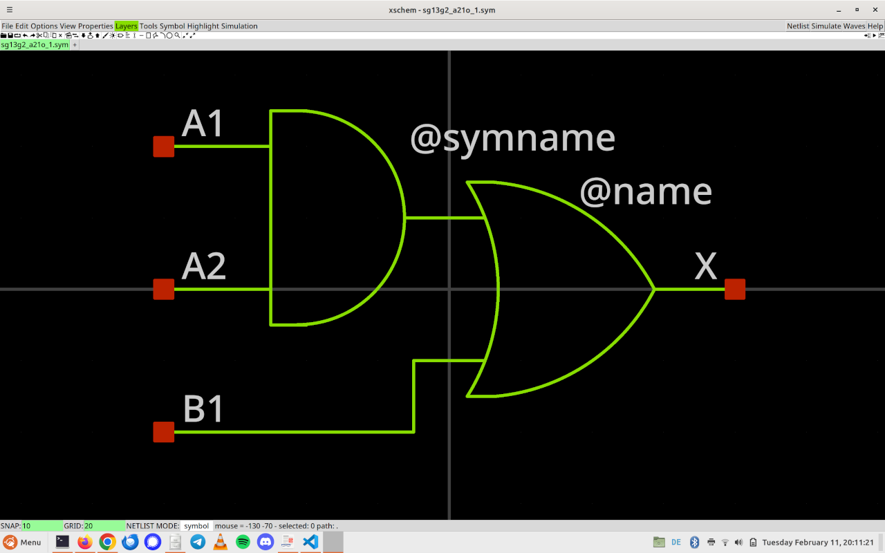

### Liberty files

- Liberty files (.lib) contain information about timing, power and temperature of the cells.
- The ihp130-sg13g2 PDK contains six different Liberty files for the standard cells.
- These six files are categorized by nominal voltages and nominal temperatures:

Liberty file                         Voltage     Temperature 
----------------------------------   -------     -----------
sg13g2_stdcell_fast_1p32V_m40C.lib    1.32 V      -40° C 
sg13g2_stdcell_fast_1p65V_m40C.lib    1.65 V      -40° C
sg13g2_stdcell_slow_1p08V_125C.lib    1.08 V      125° C
sg13g2_stdcell_slow_1p35V_125C.lib    1.35 V      125° C
sg13g2_stdcell_typ_1p20V_25C.lib      1.20 V      25° C
sg13g2_stdcell_typ_1p50V_25C.lib      1.50 V      25° C

- The PDK contains .lib files for RAM macros and io cells too.

### Cell AO21: Liberty description

- The cell AO21 (first cell in the standard cell library list) has 622 lines of data in the lib file.
- The cell description contains:
  - First comes the leakage power for the whole truth table on the inputs.
  - After that each pin gets described with its timing and power characteristics 
  - The order of the pins starts with the output. Order: X, A1, A2, B1


### Cell AO21: Liberty file extract:

```
  cell (sg13g2_a21o_1) {
    area : 12.7008;
    cell_footprint : "AO21";
    cell_leakage_power : 158.343;
    leakage_power () {
      value : 163.606;
      when : "!A1&!A2&!B1";
    }

...

    pin (X) {
      direction : "output";
      function : "((A1*A2)+B1)";

...

    pin (B1) {
      direction : "input";
      max_transition : 2.5074;

...

```


## Ruleset documents

### Layout rules document

[https://github.com/IHP-GmbH/IHP-Open-PDK/tree/main/ihp-sg13g2/libs.doc/doc](https://github.com/IHP-GmbH/IHP-Open-PDK/tree/main/ihp-sg13g2/libs.doc/doc)

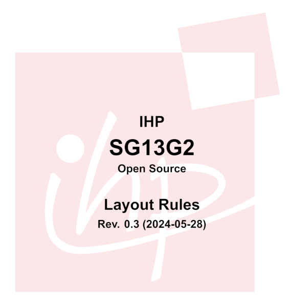

### Process specification document

[https://github.com/IHP-GmbH/IHP-Open-PDK/tree/main/ihp-sg13g2/libs.doc/doc](https://github.com/IHP-GmbH/IHP-Open-PDK/tree/main/ihp-sg13g2/libs.doc/doc)

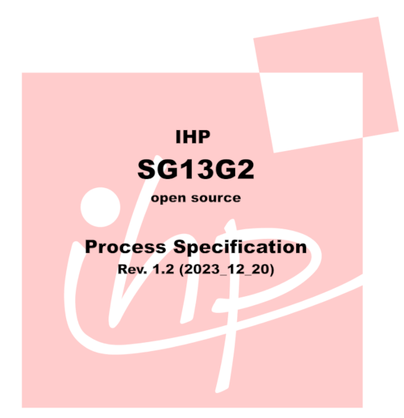