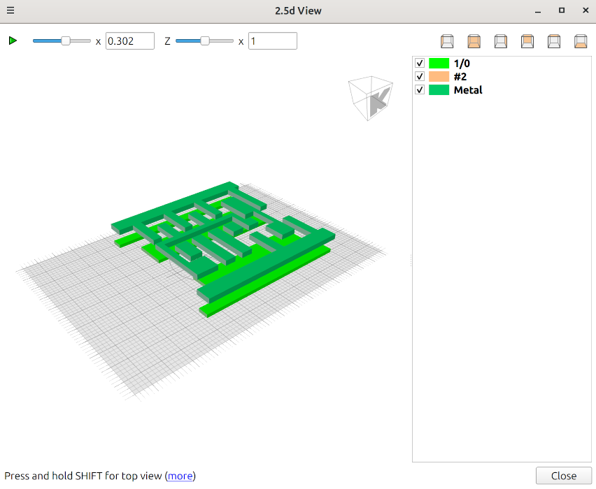

# Chapter 5 - PDK Examination - TRAINING - Advanced

## Start with common training

##### Task: Common training first

- Do the common training from chapter 05 first.
- You should have
    - a standard cell open in KLayout.
    - the PDK lyp file loaded.

## Run a 2.5d script

##### Task: Run 2.5 script

- Open the 2.5d script editor:
    - Tools -> 2.5d View -> New 2.5d Script
- Press the play button (in the middule of the upper tool row)
- The Viewer should pop up and show the cell in 2.5d

## Examine th cell in 2.5d

##### Task: Examine 2.5d view

## Add layers in the script

- You will see only a little of the standard cells layers.
- That is because the script is very basic.

##### Task: Enhance the 2.5d script

- Try to add at least one more layer to the 2.5d script
- Run again and see the result.

##### Tip: Cheat from a pre-made script

Here is a script with some more layers in it:
[https://gist.github.com/rslawson/fecc97d8731da95204ed59b00571582f](https://gist.github.com/rslawson/fecc97d8731da95204ed59b00571582f)

## View a more complex design

##### Task:

- Load a coplete design GDS into KLayout,
- Run a 2.5d script and see the viewer.