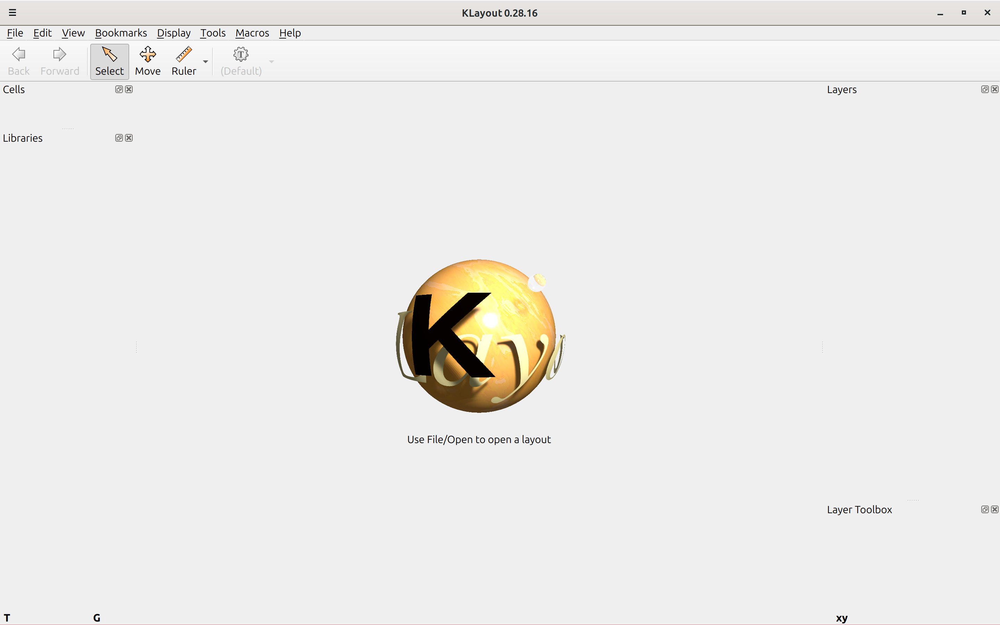

# Chapter 5 - PDK Examination - TRAINING - Advanced

## 1. Open Klayout

* Execute ```klayout``` in console shell.
* Klayout starts in viewer mode.
* Edit mode can be started with ```klayout -e``` but is not needed for this training.

### 1. Open Klayout



## 2. Matchmaking a cell

* Here is a 3D rendering of a standard cell (Insert name? Or find name?)
* ToDo: Insert cell picture
* Can you identify the layers and their order from the cell?

### 2. Matchmaking a cell

ToDo.

## 3. Examing cell GDS

Todo.
* Search for the cell GDS and examine the layers and their order.

### 3. Examine cell GDS

Todo.
- Picture of 

## 4. Logic function of the cell

- Find the schematic of the cell.

### 4. Logic function of the cell

- Match the schematic and the logic function of the cell.

