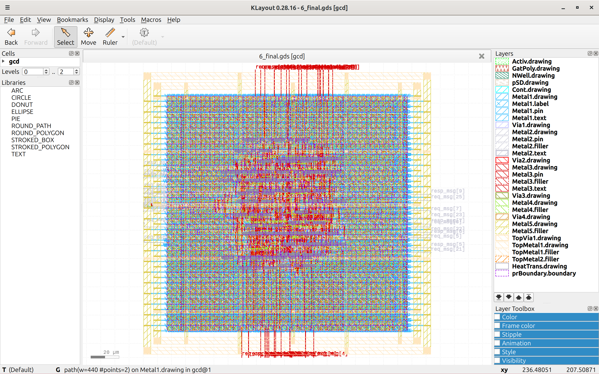

# Chapter 5 - PDK Examination - TRAINING - Common

## 1. Open Klayout

* Execute ```klayout``` in console shell.
* Klayout starts in viewer mode.
* Edit mode can be started with ```klayout -e``` but is not needed for this training.

### 1. Open Klayout


## 2. Load example GDS

* Search for the final GDS from your example run and load it into Klayoutv

### 2. Load example GDS


## 3. Use a LYP file

* Recall: What are layer properties and the .lyp file?
* Search the sg13g2 lyp-file from the PDK and enable it in Klayout.
* Make it the default lyp in Klayout.
* Look for changes in the layer list and the GDS.
* What has changed?

### 3. Use a LYP file



## 4. Navigate Layers and GDS

* In the layer list:
    * Enable "Hide empty layers".
    * Enable "Visibility follows selection".
    * De-/Select multiple layers and see the changes.
* Zoom out to see the complete GDS and de-/select layers.
* Zoom into details and de-/select layers.
* Move the GDS file while zoomed in.
* Try to find interesting views.
* Discuss with neighbours what might be of interest.

### 4. Navigate Layers and GDS


### 4. Navigate Layers and GDS


## 5. Load cell library GDS

* Now open another GDS: the standard cell library from the sg13g2 PDK.
* The standard cell library is a single GDS file. Search and load the library file.

### 5. Load cell library GDS


## 6. Pick a cell

* All the cell names are displayed in a window to the left. One cell is selected (displayed in bold). The GDS of this cell is viewed. Try to bring another cell "to the top" to see that cells GDS.
* Repeat the layer navigation like in the eaxmple GDS.

### 6. Pick a cell


