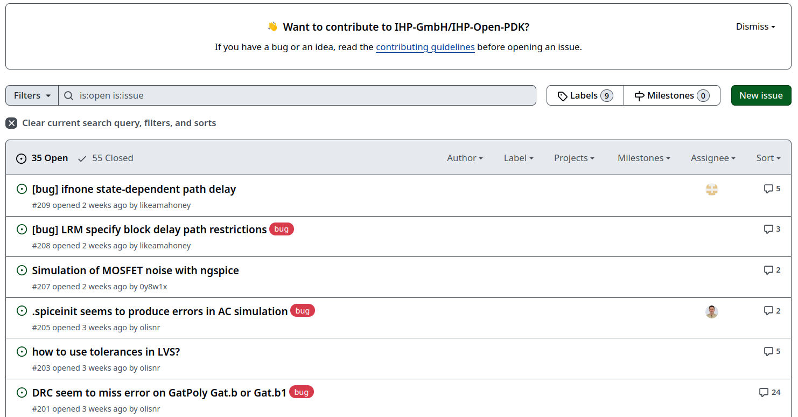
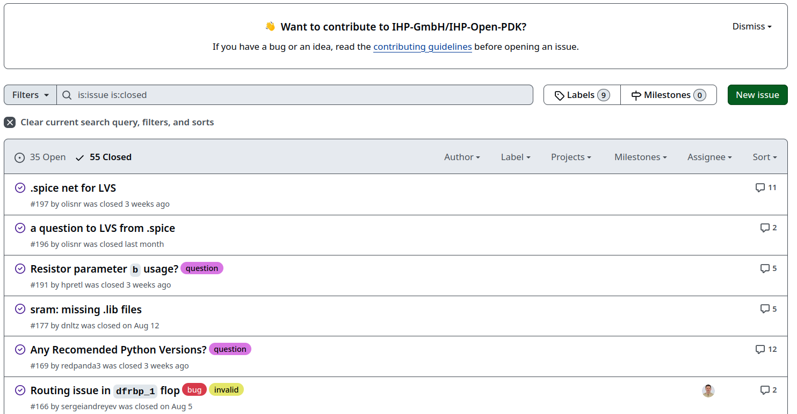
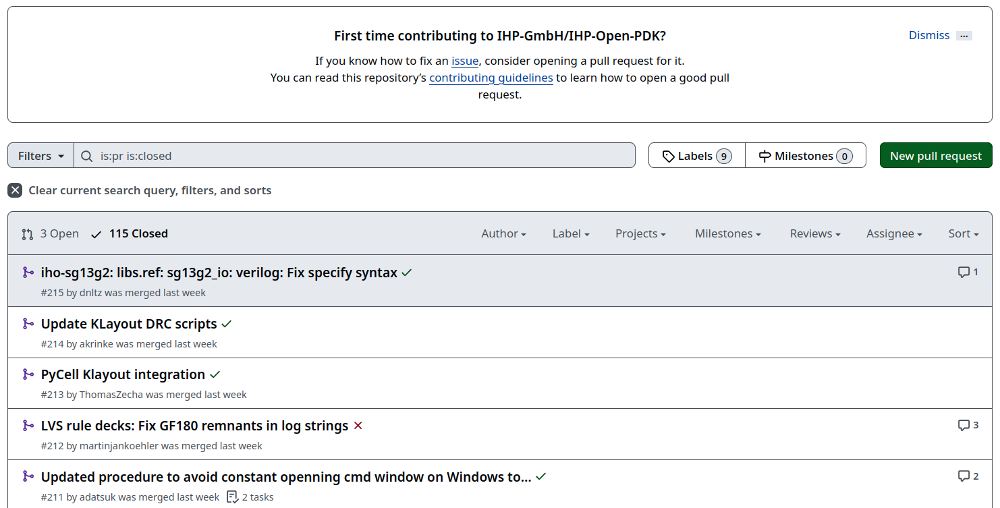
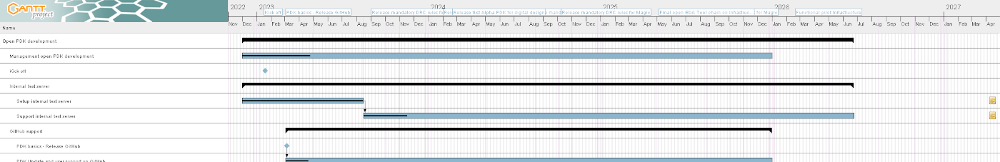

# What is a PDK?

## Wikipedia definition
__A process design kit (PDK)__ is a set of files used within the semiconductor industry to model a fabrication process for the design tools used to design an integrated circuit. The PDK is created by the foundry defining a certain technology variation for their processes. ... 

... The designers use the PDK to design, simulate, draw and verify the design before handing the design back to the foundry to produce chips. The data in the PDK is specific to the foundry's process variation and is chosen early in the design process, influenced by the market requirements for the chip. An accurate PDK will increase the chances of first-pass successful silicon.

Source: [https://en.wikipedia.org/wiki/Process_design_kit](https://en.wikipedia.org/wiki/Process_design_kit)

## Open-source viewpoint
ToDo: 
Image of the border between development and production

## In the context of this course

# Open-Source PDK and GitHub

## Difference from closed source
With publishing a PDK under a open-source license, the development from there on becomes a worldwide visible joint effort. The number of contributors and authors of the PDK can only increase from here on. 

## Collaborative workflow in GitHub
Some of the main principles of open-source are the permissions to use, study, change and re-distribute the published code and data according to the license. This leads to a open collaboration in which everyone can participate.

GitHub enables a workflow that was designed and build with these principles and opportunities in mind. A good starting point to explore the open collaboration in the IHP PDK are

* [Issues (open and closed)](https://github.com/IHP-GmbH/IHP-Open-PDK/issues)
* [Pull requests (open and closed)](https://github.com/IHP-GmbH/IHP-Open-PDK/pulls)

The topics and discussions that you can read and study there will draw a picture of how the process of open collaboration works for the PDK.

## Issues openss



## Issues closed



## Pull requests closed



## Resources for you
 

## Contributing?
Wiki

# Content of the PDK ihp-sg13g2

## The README
The Readme file in the PDKs repository is the starting point for information about the content of the PDK. 

[https://github.com/IHP-GmbH/IHP-Open-PDK/blob/main/README.md](https://github.com/IHP-GmbH/IHP-Open-PDK/blob/main/README.md)


## Project roadmap
A GANTT chart of the roadmap for the open-source PDK is available under this weblink. It shows the projects timeline (2022 - 2026):

[https://github.com/IHP-GmbH/IHP-Open-PDK/blob/main/ihp-sg13g2/libs.doc/roadmap/open_PDK_gantt.png](https://github.com/IHP-GmbH/IHP-Open-PDK/blob/main/ihp-sg13g2/libs.doc/roadmap/open_PDK_gantt.png)



## Cells in the PDK
There are four different sets of cells (or devices) in the PDK:

* Base cellset with limited set of standard logic cells
    * CDL, GDSII, LEF, Tech LEF
    * Liberty, SPICE Netlist, Verilog
* IO cellset
    * GDSII, LEF, Liberty (dummy), SPICE Netlist
* SRAM cellset
    * CDL, GDSII, LEF, Liberty, Verilog
* Primitive devices
    * GDSII


## Other data in the PDK
* KLayout tool data:
    * layer property and tech files
    * DRC rules (minimal set)
    * PyCells
        * initial version of the wrapper API
        * sample cells
* Pcells (for reference only) libs.tech/pycell
* MOS/HBT/Passive device models for ngspice/Xyce
* xschem: primitive device symbols, settings and testbenches
* OpenEMS: tutorials, scripts, documentation
* SG13G2 Process specification & Layout Rules
* MOS/HBT Measurements in MDM format
* Project Roadmap Gantt chart

## Standard cell library

ToDo:

* Where in the RTl-to-GDS is the cell library needed?
* Design to cells to GDS and Tapeout
* Naming of the cells

## A single cell from the library

ToDo:

* Pick one cell
* Pictures of the layers of the cell
    * Klayout
    * 3D Rederings?
* Schematic of the cell

## Layer stack
IHP sg13g2 Layers in a picture.


Source: https://github.com/IHP-GmbH/IHP-Open-PDK/blob/main/ihp-sg13g2/libs.doc/doc/SG13G2_os_process_spec.pdf

# File formats

## Cell AO21: VERILOG HDL language
```
// type: AO21 
`timescale 1ns/10ps
`celldefine
module sg13g2_a21o_1 (X, A1, A2, B1);
	output X;
	input A1, A2, B1;

	// Function
	wire int_fwire_0;

	and (int_fwire_0, A1, A2);
	or (X, int_fwire_0, B1);

	// Timing
	specify
		(A1 => X) = 0;
		(A2 => X) = 0;
		if (A1 == 1'b1 & A2 == 1'b0)
			(B1 => X) = 0;
		if (A1 == 1'b0 & A2 == 1'b1)
			(B1 => X) = 0;
		ifnone (B1 => X) = 0;
	endspecify
endmodule
`endcelldefine
```

## Cell AO21: SPICE Netlist
```
* Library name: sg13g2_stdcell
* Cell name: sg13g2_a21o_1
* View name: schematic
* Inherited view list: spectre cmos_sch cmos.sch schematic veriloga ahdl
* pspice dspf
.subckt sg13g2_a21o_1 A1 A2 B1 VDD VSS X
XN0 net1 A1 net2 VSS sg13_lv_nmos w=640.00n l=130.00n ng=1 ad=0 as=0 pd=0 ps=0 m=1
XN1 net2 A2 VSS VSS sg13_lv_nmos w=640.00n l=130.00n ng=1 ad=0 as=0 pd=0 ps=0 m=1
XN2 net1 B1 VSS VSS sg13_lv_nmos w=640.00n l=130.00n ng=1 ad=0 as=0 pd=0 ps=0 m=1
XN3 X net1 VSS VSS sg13_lv_nmos w=740.00n l=130.00n ng=1 ad=0 as=0 pd=0 ps=0 m=1
XP0 net1 B1 net3 VDD sg13_lv_pmos w=1.000u l=130.00n ng=1 ad=0 as=0 pd=0 ps=0 m=1
XP1 net3 A1 VDD VDD sg13_lv_pmos w=1.000u l=130.00n ng=1 ad=0 as=0 pd=0 ps=0 m=1
XP2 net3 A2 VDD VDD sg13_lv_pmos w=1.000u l=130.00n ng=1 ad=0 as=0 pd=0 ps=0 m=1
XP3 X net1 VDD VDD sg13_lv_pmos w=1.12u l=130.00n ng=1 ad=0 as=0 pd=0 ps=0 m=1
.ends
* End of subcircuit definition.
```

## Cell AO21: Circuit design language
```
************************************************************************
* Library Name: sg13g2_stdcell
* Cell Name:    sg13g2_a21o_1
* View Name:    schematic
************************************************************************

.SUBCKT sg13g2_a21o_1 A1 A2 B1 VDD VSS X
*.PININFO A1:I A2:I B1:I X:O VDD:B VSS:B
MN0 net1 A1 net2 VSS sg13_lv_nmos m=1 w=640.00n l=130.00n ng=1
MN1 net2 A2 VSS VSS sg13_lv_nmos m=1 w=640.00n l=130.00n ng=1
MN2 net1 B1 VSS VSS sg13_lv_nmos m=1 w=640.00n l=130.00n ng=1
MN3 X net1 VSS VSS sg13_lv_nmos m=1 w=740.00n l=130.00n ng=1
MP0 net1 B1 net3 VDD sg13_lv_pmos m=1 w=1.000u l=130.00n ng=1
MP1 net3 A1 VDD VDD sg13_lv_pmos m=1 w=1.000u l=130.00n ng=1
MP2 net3 A2 VDD VDD sg13_lv_pmos m=1 w=1.000u l=130.00n ng=1
MP3 X net1 VDD VDD sg13_lv_pmos m=1 w=1.12u l=130.00n ng=1
.ENDS
```

# Ruleset documents
