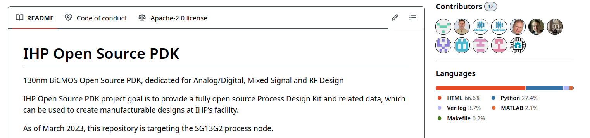
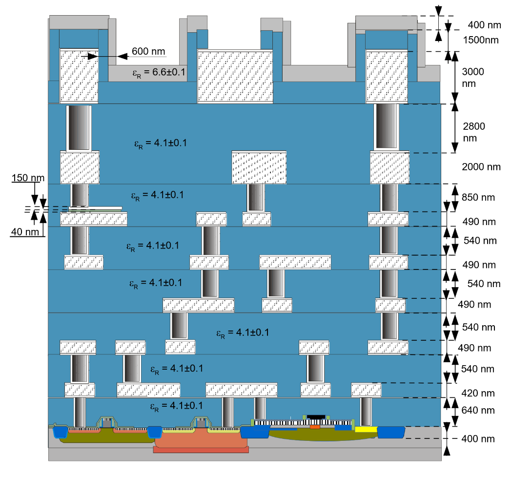

# What is a PDK?
## Wikipedia definition
__A process design kit (PDK)__ is a set of files used within the semiconductor industry to model a fabrication process for the design tools used to design an integrated circuit. The PDK is created by the foundry defining a certain technology variation for their processes. ... 

... The designers use the PDK to design, simulate, draw and verify the design before handing the design back to the foundry to produce chips. The data in the PDK is specific to the foundry's process variation and is chosen early in the design process, influenced by the market requirements for the chip. An accurate PDK will increase the chances of first-pass successful silicon.

Source: [https://en.wikipedia.org/wiki/Process_design_kit](https://en.wikipedia.org/wiki/Process_design_kit)

## Open-source viewpoint

# Open-Source PDK
## Different from closed source
## Git workflow with examples
## Resources for you
## Contributing?
Wiki

# Content of the PDK ihp-sg13g2
## The README
The Readme file in the PDKs repository is the starting point for information about the content of the PDK. 

[https://github.com/IHP-GmbH/IHP-Open-PDK/blob/main/README.md](https://github.com/IHP-GmbH/IHP-Open-PDK/blob/main/README.md)

## Project roadmap
A GANTT chart of the roadmap for the open-source PDK is available under this weblink. It shows the projects timeline (2022 - 2026):

[https://github.com/IHP-GmbH/IHP-Open-PDK/blob/main/ihp-sg13g2/libs.doc/roadmap/open_PDK_gantt.png](https://github.com/IHP-GmbH/IHP-Open-PDK/blob/main/ihp-sg13g2/libs.doc/roadmap/open_PDK_gantt.png)

## Cells in the PDK
* Base cellset with limited set of standard logic cells
    * CDL
    * GDSII
    * LEF, Tech LEF
    * Liberty
    * SPICE Netlist
    * Verilog
* IO cellset
    * GDSII
    * LEF
    * Liberty (dummy)
    * SPICE Netlist
* SRAM cellset
    * CDL
    * GDSII
    * LEF
    * Liberty
    * Verilog
* Primitive devices
    * GDSII
## Other data in the PDK
* KLayout tool data:
    * layer property and tech files
    * DRC rules (minimal set)
    * PyCells
        * initial version of the wrapper API
        * sample cells
* Pcells (for reference only) libs.tech/pycell
* MOS/HBT/Passive device models for ngspice/Xyce
* xschem: primitive device symbols, settings and testbenches
* OpenEMS: tutorials, scripts, documentation
* SG13G2 Process specification & Layout Rules
* MOS/HBT Measurements in MDM format
* Project Roadmap Gantt chart
## Standard cell library
## A single cell
## Layer stack
IHP sg13g2 Layers in a picture.

Source: https://github.com/IHP-GmbH/IHP-Open-PDK/blob/main/ihp-sg13g2/libs.doc/doc/SG13G2_os_process_spec.pdf

## File formats
## Ruleset documents
