# Chapter 6 - OpenROAD GUI

## Analysing desings with the GUI

### View layout

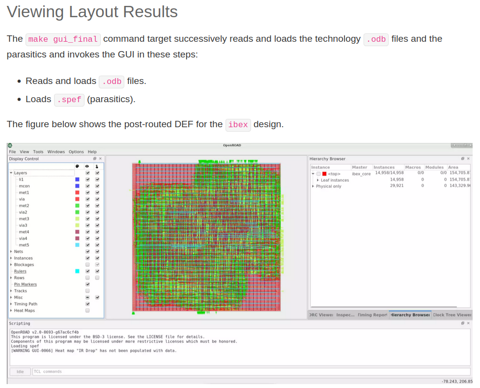

### View objects

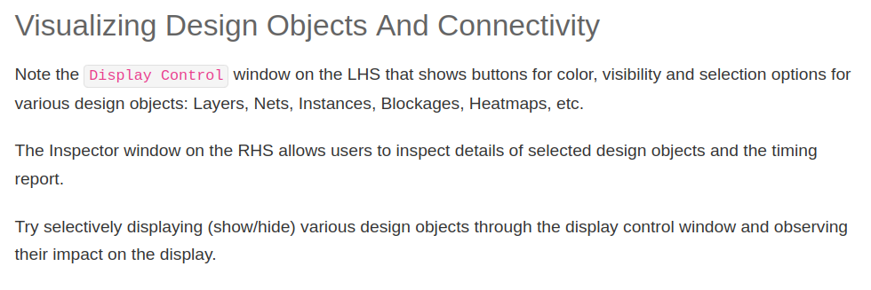

### Clock tree

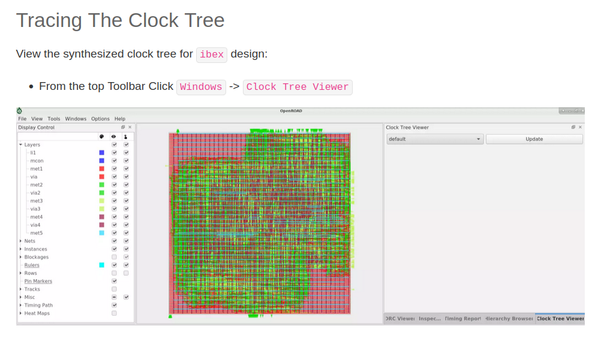

### Heat maps

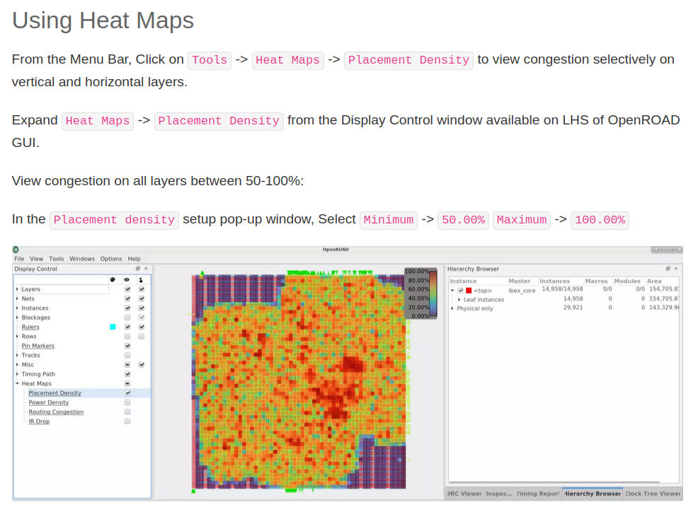

### Timing report

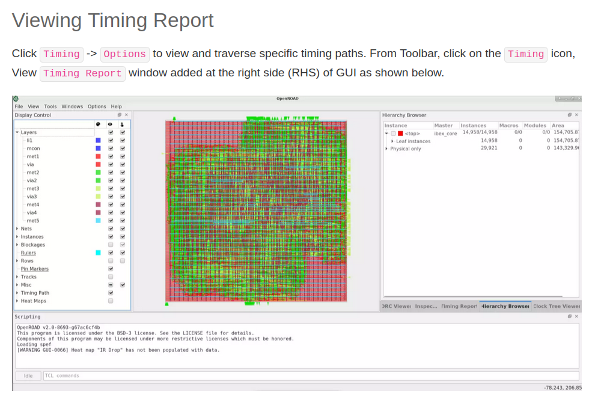

### Rulers (measure distances)

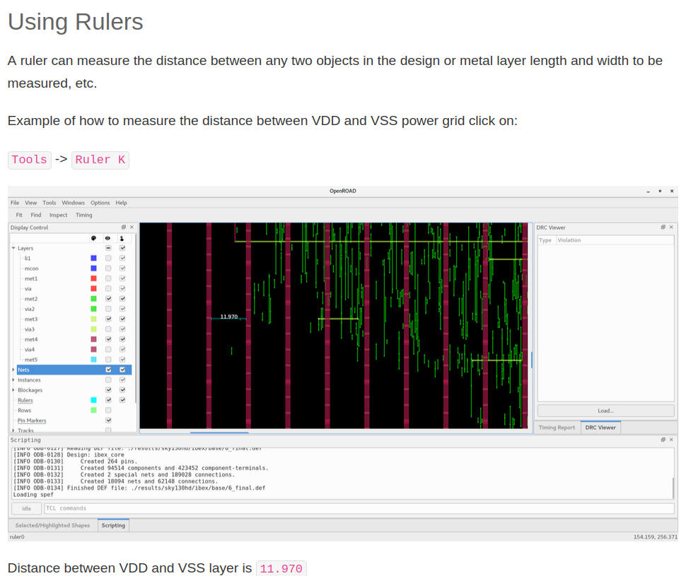

### TCL command interface

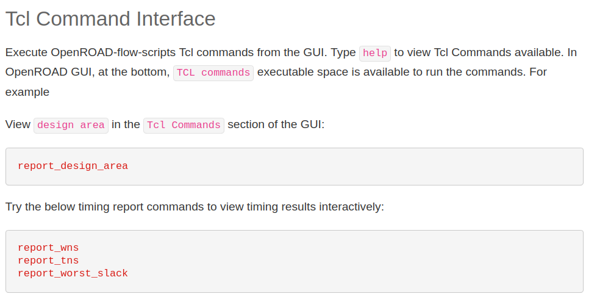

### Area report

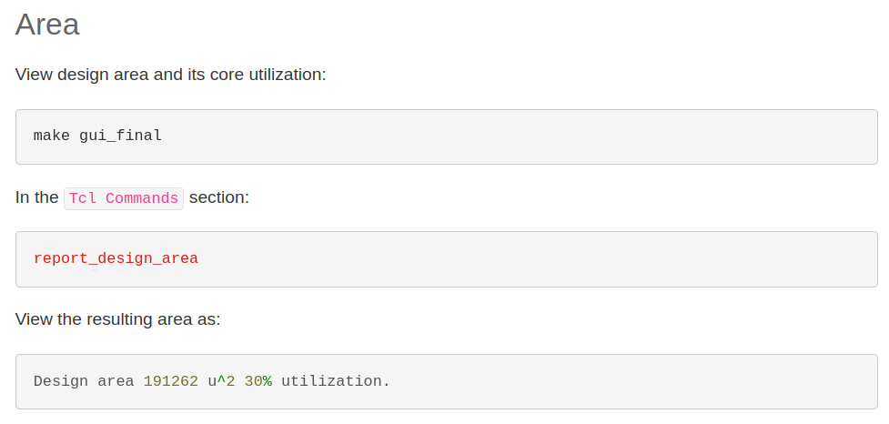

### Timing slack report

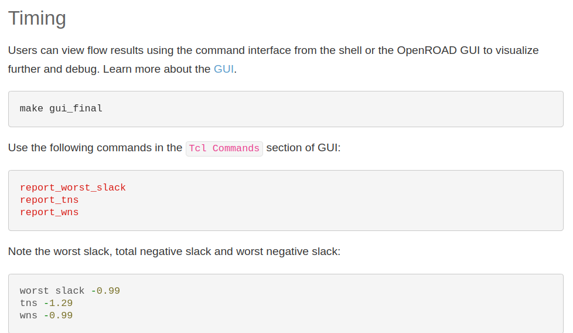

### Power report

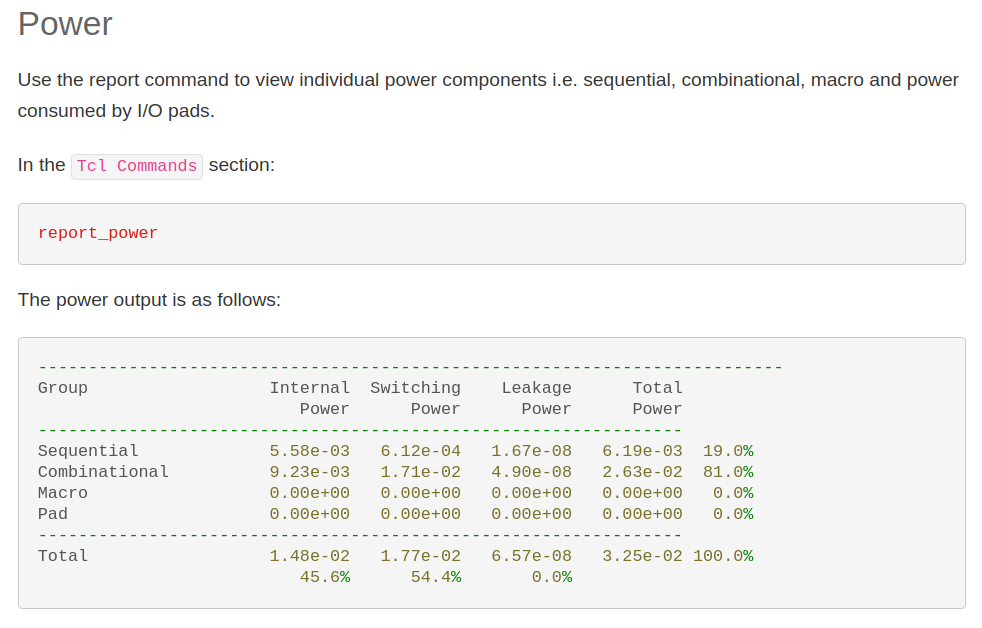

### DRC viewer

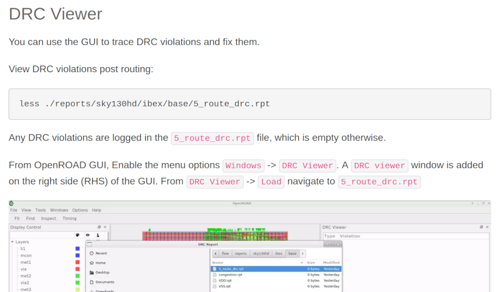
