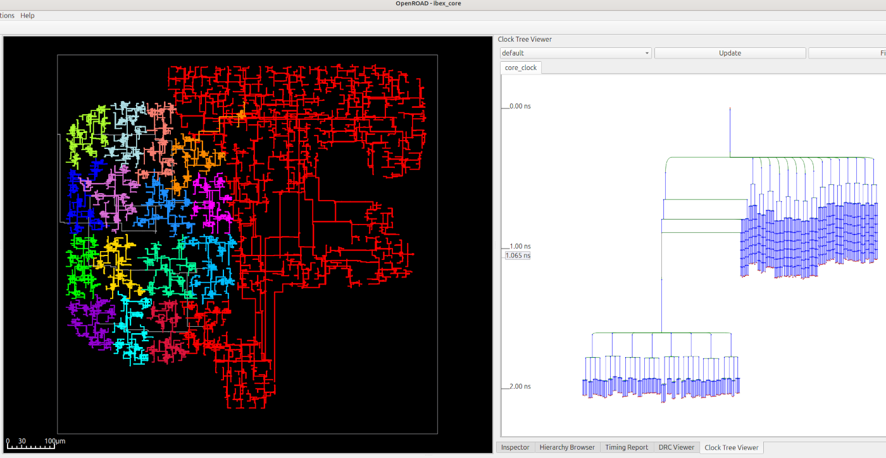
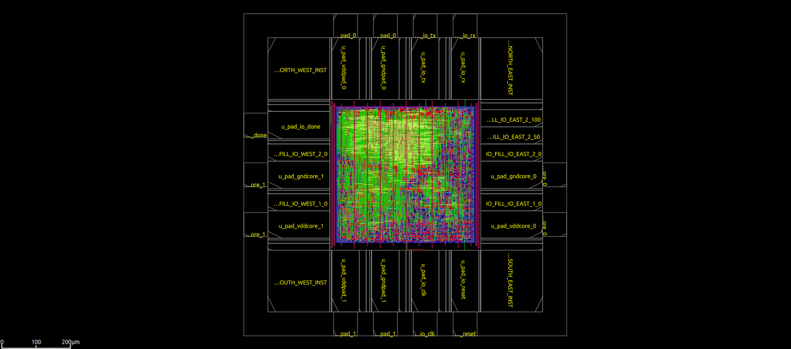

# Chapter 6 - OpenROAD GUI - TRAINING - Common

## Guess and rebuild

### Challenge 1

Rebuild the picture with any design!

### Challenge 2

Rebuild the picture with any design!

### Challenge 3

Rebuild the picture with any design!

### Challenge 4

Rebuild the picture with any design!

### Solutions (of the challenges)

1. Ibex clocktree without most other layers (IHP PDK)
2. Ibex power density >15 uW (IHP PDK)
3. Ibex single clock path with all layers off, but the timing paths (IHP PDK)
4. Masked aes without most metals and only pins names (IHP PDK)
