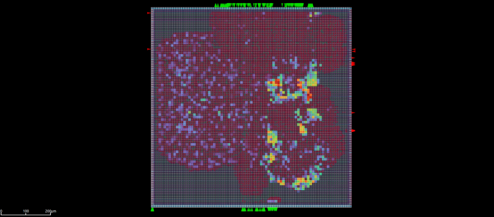
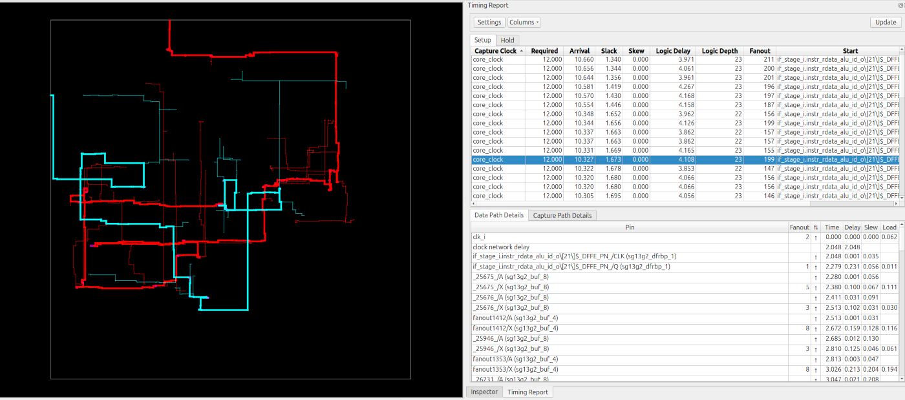

# Chapter 6 - OpenROAD GUI - TRAINING - Common

## Guess and rebuild

### Rebuild the challenges

##### Task: 
Rebuild the next four pictures with any design!

### Challenge 1

### Challenge 2

### Challenge 3

### Challenge 4

## Play the DRC example from ORFS

The ORFS tutorial contains an example for DRC errors in a design and how to view the DRC errors with the ORFS gui.

##### Task: Do the DRC error example

Link:

[https://openroad-flow-scripts.readthedocs.io/en/latest/tutorials/FlowTutorial.html#drc-viewer](https://openroad-flow-scripts.readthedocs.io/en/latest/tutorials/FlowTutorial.html#drc-viewer)

- Do the steps in the order from the tutorial
- Try to get to the 0 DRC errors.

### Solutions (of the challenges)

1. Ibex clocktree without most other layers (IHP PDK)
2. Ibex power density >15 uW (IHP PDK)
3. Ibex single clock path with all layers off, but the timing paths (IHP PDK)
4. Masked aes without most metals and only pins names (IHP PDK)
