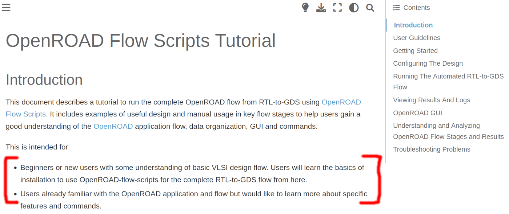
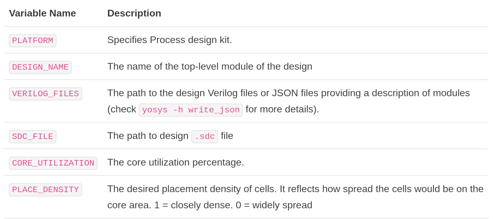
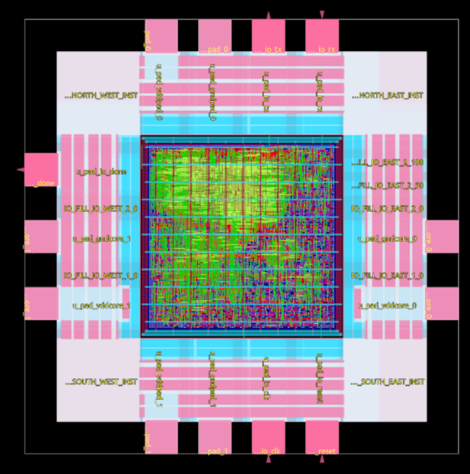
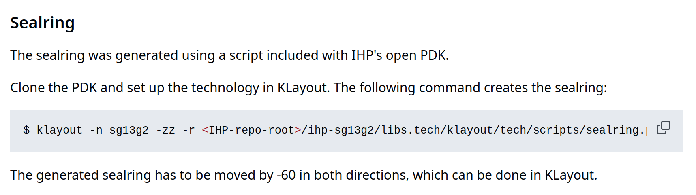

# Chapter 7 - OpenROAD flow scripts

## Introduction

What happend on the way to here:

- GDS-2-RTL: OpenROAD
- OpenROAD flow scripts (ORFS) overview
- ORFS flow steps and flow components
- First run of the flow scripts
- A Dive into the PDK (Klayout)
- Analysing: Heatmaps and more (ORFS GUI)

NOW:

- One day of using ORFS
- Getting a hands on with important data and features.

## ORFS Tutorial

There is a good tutorial about ORFS in the official documentation:

[https://openroad-flow-scripts.readthedocs.io/en/latest/tutorials/FlowTutorial.html](https://openroad-flow-scripts.readthedocs.io/en/latest/tutorials/FlowTutorial.html)

The ORFS online-tutorial was not written for the use with the IHP PDK especially, but we can adopt this easily.

###



## Multiple runs

### Caveats of multiple runs in ORFS

- ORFS does not handle multiple runs for a single design.
- The design run must be cleared with make clean_all, before a new runs can be started.
- !!! The previous data from the previous run will be lost. 

Side feature:

- A run can start over where you left it.

### Workaround for saving the design data

1. After a design run:
    * Rename the results directory to something different:
        * flow/results/ihp-sg13g2/designname/base
        * flow/results/ihp-sg13g2/designname/base_old_1
    * Rename the reports directory to something different:
        * flow/reports/ihp-sg13g2/designname/base
        * flow/reports/ihp-sg13g2/designname/base_old_1
2. With the start of the next run (make):
    * The original directory gets created again.
3. Repeat that before every new run of the same design.

### Reviewing the older design data

- The command ```make gui_final``` only works on the enabled design (Makefile, DESIGN_CONFIG)
- To load an older design from a renamed folder, run ```openroad -gui```
- This opens an empty GUI and you can load a GDS into it.
- This can be done multiple times in parallel.

## Structure of flow directories

Inside the flow directory:

```
flow$ ls

Makefile     platforms  test
designs      reports    tutorials
results      util       logs         
objects      scripts
```

- **Makefile**: Runs the RTL-2-GDS toolchain with a design 
- **platforms**: Technology nodes and PDKs
- **designs**: Source and configuration files of the designs
- **reoprts**: Generated report files from the design runs
- **results**: Generated result files from the design runs

## TCL Console and commands

At the bottom of the OpenROAD GUI is the TCl command console.

Type ```help``` into the console to get a list of the avaiable commands and their syntax.

Some commands that were already used in this couse:

- save_image
- report_design_area
- report_power
- report_worst_slack

## Reports

- Reports get generated for each design run. 
- The reports are stored in the reports directory.
- These are the report files for the gcd example:

```
reports/ihp-sg13g2/gcd/base$ ls

2_floorplan_final.rpt  6_finish.rpt          final_resizer.webp
3_detailed_place.rpt   congestion.rpt        final_routing.webp
3_resizer.rpt          cts_core_clock.webp   grt_antennas.log
4_cts_final.rpt        drt_antennas.log      synth_check.txt
5_global_place.rpt     final_clocks.webp     synth_stat.txt
5_global_route.rpt     final_ir_drop.webp    VDD.rpt
5_route_drc.rpt        final_placement.webp  VSS.rpt
```

## Logs

- Logs get generated for each design run. 
- The logs are stored in the logs directory.
- These are the log files for the gcd example:

```
logs/ihp-sg13g2/gcd/base$ ls

1_1_yosys_canonicalize.log  2_6_floorplan_pdn.json     4_1_cts.log
1_1_yosys_hier_report.log   2_6_floorplan_pdn.log      5_1_grt.json
1_1_yosys.log               3_1_place_gp_skip_io.json  5_1_grt.log
2_1_floorplan.json          3_1_place_gp_skip_io.log   5_2_route.json
2_1_floorplan.log           3_2_place_iop.json         5_2_route.log
2_2_floorplan_io.json       3_2_place_iop.log          5_3_fillcell.json
2_2_floorplan_io.log        3_3_place_gp.json          5_3_fillcell.log
2_3_floorplan_tdms.json     3_3_place_gp.log           6_1_fill.json
2_3_floorplan_tdms.log      3_4_place_resized.json     6_1_fill.log
2_4_floorplan_macro.json    3_4_place_resized.log      6_1_merge.log
2_4_floorplan_macro.log     3_5_place_dp.json          6_report.json
2_5_floorplan_tapcell.json  3_5_place_dp.log           6_report.log
2_5_floorplan_tapcell.log   4_1_cts.json
```

## Results

- Results (mostly odb, GDS) get generated for each design run. 
- The results are stored in the results directory.
- These are the result files for the gcd example:

```
flow/results/ihp-sg13g2/gcd/base$ ls

1_1_yosys.v                3_3_place_gp.odb       6_1_fill.sdc
1_synth.rtlil              3_4_place_resized.odb  6_1_fill.v
1_synth.sdc                3_5_place_dp.odb       6_1_merged.gds
1_synth.v                  3_place.odb            6_final.def
2_1_floorplan.odb          3_place.sdc            6_final.gds
2_2_floorplan_io.odb       4_1_cts.odb            6_final.odb
2_3_floorplan_tdms.odb     4_cts.odb              6_final.sdc
2_4_floorplan_macro.odb    4_cts.sdc              6_final.spef
2_5_floorplan_tapcell.odb  5_1_grt.odb            6_final.v
2_6_floorplan_pdn.odb      5_2_route.odb          clock_period.txt
2_floorplan.odb            5_3_fillcell.odb       keep_hierarchy.tcl
2_floorplan.sdc            5_route.odb            mem.json
3_1_place_gp_skip_io.odb   5_route.sdc            route.guide
3_2_place_iop.odb          6_1_fill.odb           updated_clks.sdc
```

## Basic design initialization

### Design configuration (config.mk)

config.mk from the ibex example:

[https://github.com/The-OpenROAD-Project/OpenROAD-flow-scripts/blob/master/flow/designs/sky130hd/ibex/config.mk](https://github.com/The-OpenROAD-Project/OpenROAD-flow-scripts/blob/master/flow/designs/sky130hd/ibex/config.mk)

Tutorial about the design configuration;

[https://openroad-flow-scripts.readthedocs.io/en/latest/tutorials/FlowTutorial.html#design-configuration](https://openroad-flow-scripts.readthedocs.io/en/latest/tutorials/FlowTutorial.html#design-configuration)

###



### Clock constraints (constraints.sdc)

constraints.sdc from the ibex example:

```
current_design ibex_core

set clk_name  core_clock
set clk_port_name clk_i
set clk_period 10.0
set clk_io_pct 0.2

set clk_port [get_ports $clk_port_name]

create_clock -name $clk_name -period $clk_period $clk_port

set non_clock_inputs [lsearch -inline -all -not -exact [all_inputs] $clk_port]

set_input_delay  [expr $clk_period * $clk_io_pct] -clock $clk_name $non_clock_inputs 
set_output_delay [expr $clk_period * $clk_io_pct] -clock $clk_name [all_outputs]
```

[https://openroad-flow-scripts.readthedocs.io/en/latest/tutorials/FlowTutorial.html#timing-constraints](https://openroad-flow-scripts.readthedocs.io/en/latest/tutorials/FlowTutorial.html#timing-constraints)

### Design Verilog input

[https://openroad-flow-scripts.readthedocs.io/en/latest/tutorials/FlowTutorial.html#design-input-verilog](https://openroad-flow-scripts.readthedocs.io/en/latest/tutorials/FlowTutorial.html#design-input-verilog)

These are the Verilog files of the ibex design example:

```
flow/designs/src/ibex$ ls

ibex_alu.v                 ibex_ex_block.v         ibex_register_file_ff.v      prim_ram_1p.v
ibex_branch_predict.v      ibex_fetch_fifo.v       ibex_register_file_fpga.v    prim_secded_28_22_dec.v
ibex_compressed_decoder.v  ibex_icache.v           ibex_register_file_latch.v   prim_secded_28_22_enc.v
ibex_controller.v          ibex_id_stage.v         ibex_wb_stage.v              prim_secded_39_32_dec.v
ibex_core.v                ibex_if_stage.v         LICENSE                      prim_secded_39_32_enc.v
ibex_counter.v             ibex_load_store_unit.v  prim_badbit_ram_1p.v         prim_secded_72_64_dec.v
ibex_cs_registers.v        ibex_multdiv_fast.v     prim_clock_gating.v          prim_secded_72_64_enc.v
ibex_csr.v                 ibex_multdiv_slow.v     prim_generic_clock_gating.v  prim_xilinx_clock_gating.v
ibex_decoder.v             ibex_pmp.v              prim_generic_ram_1p.v        README.md
ibex_dummy_instr.v         ibex_prefetch_buffer.v  prim_lfsr.v
```

## Design tweaking

- OpenROAD is build on many different tools
- It does not feel consistent to configure the tools. 
- To find and understand the possiblities of improving a design via tweaking one must read the documentation of the tools.
- It might take some time to become comforatable with tweaking. 
- Don't give up!

### 
In the following we present

- some easy tweaking possibilities to start with

A list of environment variables is here:

[https://openroad-flow-scripts.readthedocs.io/en/latest/user/FlowVariables.html#environment-variables-for-the-openroad-flow-scripts](https://openroad-flow-scripts.readthedocs.io/en/latest/user/FlowVariables.html#environment-variables-for-the-openroad-flow-scripts)

### Synthesis AREA or SPEED

[https://openroad-flow-scripts.readthedocs.io/en/latest/tutorials/FlowTutorial.html#area-and-timing-optimization](https://openroad-flow-scripts.readthedocs.io/en/latest/tutorials/FlowTutorial.html#area-and-timing-optimization)

In a nutshell:

- Set ABC_SPEED=1 or ABC_AREA=1 in the config.mk
- Rerun.

### DIE_AREA and CORE_AREA

- Set DIE_AREA and CORE_AREA in the config.mk
- Rerun

This is an examplefor the two variables, taken from the config.mk in the masked_aes example earlier. The comments contain a list of added spaces around the core area.

masked_aes config.mk:
```
# (Sealring: roughly 60um)
# I/O pads: 180um
# Bondpads: 70um
# Margin for core power ring: 20um
# Total margin to core area: 270um
export DIE_AREA  =   0   0 940 940
export CORE_AREA = 270 270 670 670
```

### masked_aes areas

The area calculations from the masked_aes config.mk in a GDS:



### Density

In a nutshell:

- Change the PLACE_DENSITY value in the config 
- Value between 0.2 and 0.95
- Rerun

export PLACE_DENSITY ?= 0.88

### CORE_UTILIZATION

In a nutshell:

- Change the CORE_UTILIZATION value in the config 
- Value between 20 and 80
- Rerun

export CORE_UTILIZATION = 45

### Example for Utilization and Density with the ibex design

In the ORFS tutorial is a tweak example with these two variables:

[https://openroad-flow-scripts.readthedocs.io/en/latest/tutorials/FlowTutorial.html#defining-placement-density](https://openroad-flow-scripts.readthedocs.io/en/latest/tutorials/FlowTutorial.html#defining-placement-density)

Read how this should change the GDS.

### Further reading on the topic

- The chapters in the ORFS tutorial starting here:

[https://openroad-flow-scripts.readthedocs.io/en/latest/tutorials/FlowTutorial.html#understanding-and-analyzing-openroad-flow-stages-and-results](https://openroad-flow-scripts.readthedocs.io/en/latest/tutorials/FlowTutorial.html#understanding-and-analyzing-openroad-flow-stages-and-results)

- Synthesis Explorations
- Floorplanning
- Power Planning And Analysis
- Macro or Standard Cell Placement
- Timing Optimizations
- Clock Tree Synthesis
- ... 

## Finishing a design

### Footprint for IOPads

- A TCL script is needed to arrange the IOPads around the core design area.
- This TCL script must be referenced in the config.mk:

```
export FOOTPRINT_TCL = $(DESIGN_HOME)/$(PLATFORM)/$(DESIGN_NICKNAME)/footprint.tcl
```

A working example of such a footprint.tcl can be found inside the masked_aes example:

masked_aes footprint.tcl:

[https://github.com/HEP-Alliance/masked-aes-tapeout/blob/main/footprint.tcl](https://github.com/HEP-Alliance/masked-aes-tapeout/blob/main/footprint.tcl)

### Sealring

- A sealring GDS must be generated and merged with the design GDS.
- Information about how to create a sealring is available as an example in the masked_aes README:



###

[https://github.com/HEP-Alliance/masked-aes-tapeout/tree/main?tab=readme-ov-file#sealring](https://github.com/HEP-Alliance/masked-aes-tapeout/tree/main?tab=readme-ov-file#sealring)

### Metal fill

- Ongoing issue discussion about the Metall fill:

[https://github.com/IHP-GmbH/IHP-Open-PDK/pull/229](https://github.com/IHP-GmbH/IHP-Open-PDK/pull/229)

It is solved and merged to the repo, but the issue is kept open for enhancement reasons.


