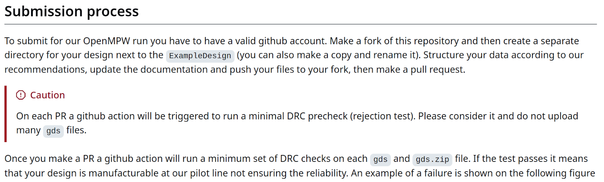
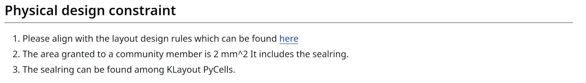
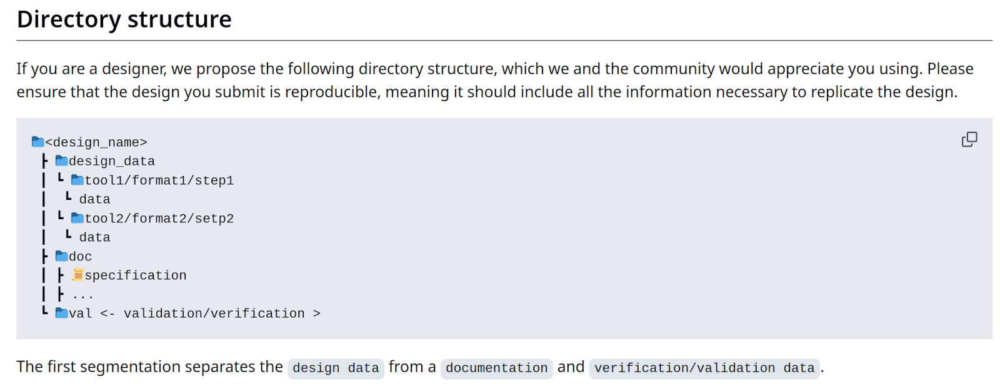
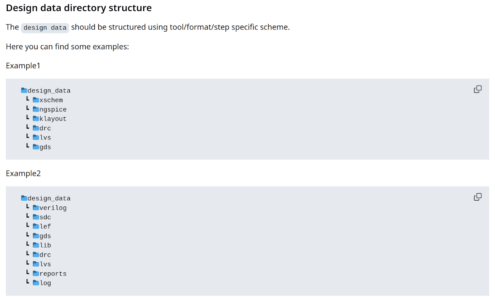
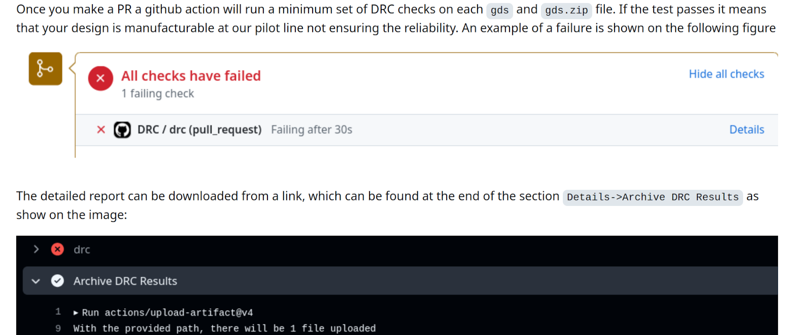
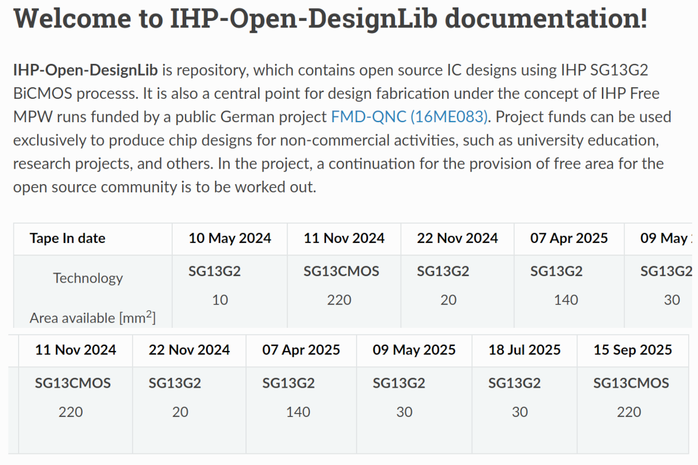
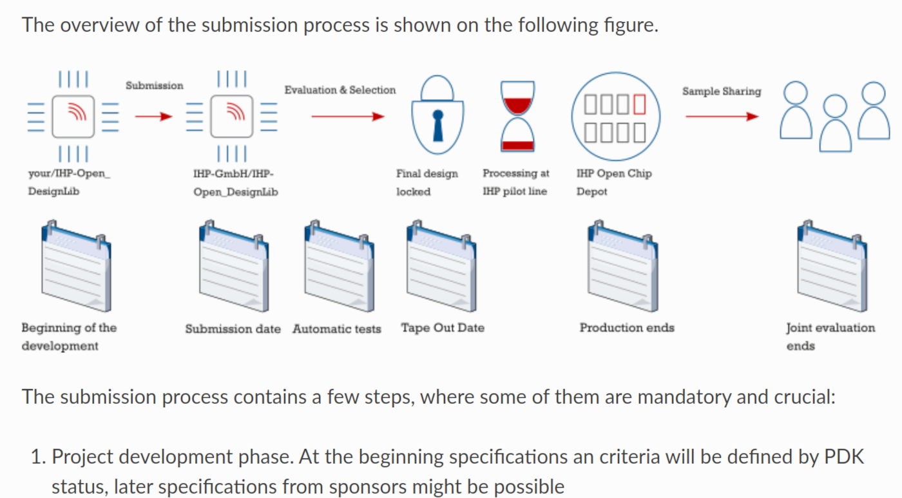
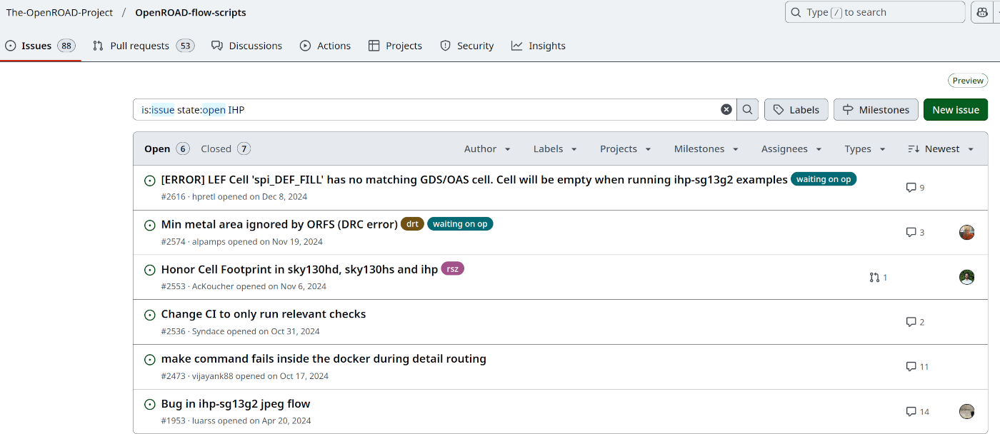
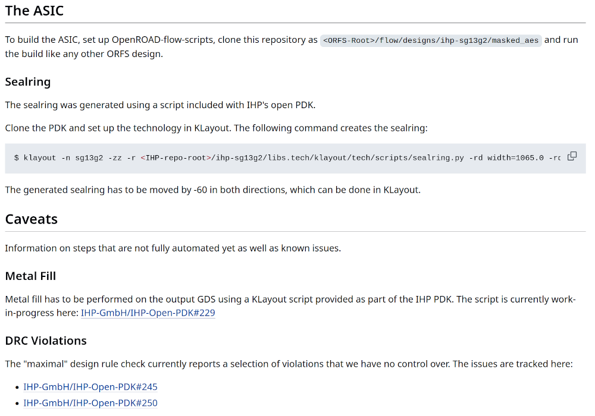
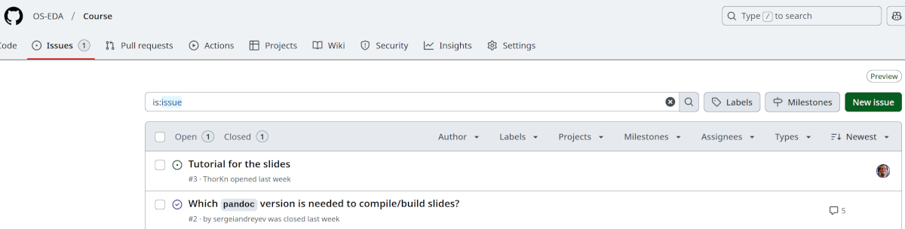

# Chapter 8 - Tapeout

## Open-source Tapeout informations from IHP

This chapter provides information about the Tapeout at IHP.
Please follow the links to tag along with the chapter.

### IHP - Repositories structure

- The designs for the open-source Tapeouts are collected as the "Open DesignLib".
- During the process of each Tapeout there are dedicated repositories by the names TO_monthyear.
- After Tapeout these designs shall be merged into the Open DesignLib repository.

### PDK and Open DesignLib

- Open.source PDK:

[https://github.com/IHP-GmbH/IHP-Open-PDK](https://github.com/IHP-GmbH/IHP-Open-PDK)

- Open DesignLib:

[https://github.com/IHP-GmbH/IHP-Open-DesignLib](https://github.com/IHP-GmbH/IHP-Open-DesignLib)

### TapeOut repositories (TO)

- Tapeout May 2024: 

[https://github.com/IHP-GmbH/TO_May2024](https://github.com/IHP-GmbH/TO_May2024)

- Tapeout Nov 2024: 

[https://github.com/IHP-GmbH/TO_Nov2024](https://github.com/IHP-GmbH/TO_Nov2024) 

- Tapeout Dec 2024: 

[https://github.com/IHP-GmbH/TO_Dec2024](https://github.com/IHP-GmbH/TO_Dec2024)

## READMEs

### README file in TO repositories
Important notes:

- Always look for the most actual and stable information
- Tools and workflows change faast
- Design rules don't change fast (if ever)
- Most parts of the PDK are long term stable

### Submission process
Screenshot from the [README TO_DEC2024](https://github.com/IHP-GmbH/TO_Dec2024/blob/main/README.md):

### Physical constraints
Screenshot from the [README TO_DEC2024](https://github.com/IHP-GmbH/TO_Dec2024/blob/main/README.md):

### Project structure
Screenshot from the [README TO_DEC2024](https://github.com/IHP-GmbH/TO_Dec2024/blob/main/README.md):

### Design data structure
Screenshot from the [README TO_DEC2024](https://github.com/IHP-GmbH/TO_Dec2024/blob/main/README.md):

### DRC

During a submission to a Tapeout the design gets checked with a DRC via Github Actions.

## Read-the-docs

- Open PDK Docu: 

[https://ihp-open-pdk-docs.readthedocs.io/en/latest/index.html](https://ihp-open-pdk-docs.readthedocs.io/en/latest/index.html)

- Open DesignLib Docu: 

[https://ihp-open-ip.readthedocs.io/en/latest/](https://ihp-open-ip.readthedocs.io/en/latest/)

### README versus Read-the-docs

- The README version is a extract of the full documentation (read-the-docs) for the DesignLib. 
- The read-the-docs version contains the Tapeout calender and further info  

### Tapeout calendar

### More submission information

## The last steps to a successful Tapeout

A few words about the finish of a Tapeout-ready GDS:

- A successfull Tapeout for a producable, correct and working micorchip contains more steps and knowdledge. It is out of scope of the course to explain and tutor these all details about this knowledge.

- Most of these steps will integrate into ORFS soon in a easy-to-use way eventually.  

### Topic to watch in design

Till then, here is a (not complete) list of important topics:

- Placement and instanciation of the Input-Outputs.
- Metall fills
- Sealring construction
- Automated DRC free

### Github Actions

- Tapeout Nov 2024 Actions drc.yml: 

[https://github.com/IHP-GmbH/TO_Nov2024/blob/main/.github/workflows/drc.yml](https://github.com/IHP-GmbH/TO_Nov2024/blob/main/.github/workflows/drc.yml)

- Tapeout Nov 2024 Actions runs: 

[https://github.com/IHP-GmbH/TO_Nov2024/actions](https://github.com/IHP-GmbH/TO_Nov2024/actions)

### Active development in ORFS

Pull requests in ORFS with the search IHP in it:

[https://github.com/The-OpenROAD-Project/OpenROAD-flow-scripts/pulls?q=IHP+](https://github.com/The-OpenROAD-Project/OpenROAD-flow-scripts/pulls?q=IHP+)

###

Issues in ORFS (open and IHP in it):

[https://github.com/The-OpenROAD-Project/OpenROAD-flow-scripts/issues?q=is%3Aissue%20state%3Aopen%20IHP](https://github.com/The-OpenROAD-Project/OpenROAD-flow-scripts/issues?q=is%3Aissue%20state%3Aopen%20IHP)

### Workarounds (example masked_aes)

The README of the design example from earlier (masked_aes) gives some basic, but sufficient information about the actual state and the workarounds.

[https://github.com/HEP-Alliance/masked-aes-tapeout/blob/main/README.md](https://github.com/HEP-Alliance/masked-aes-tapeout/blob/main/README.md)

### Before your Tapeout

If you plan to do a Tapeout with open-source to a Shuttlerun at IHP:

- Get in touch with the people at IHP before submitting a GDS.
- Inform yourself about the actual changes in the tools, the PDK and the submission repositories.
- Look for recent examples from the CoreExpert Group.

## Contribute to open-source

### Contributing with Git

If you waant to start contributing to open-source (maybe to this course?):

- Create a Git account
- Join a discussion about an issue.
- When you discover an error, writ4e an issue yourself.

It is really not much more then a ticket-system vi email.

### The Feedback to this course

Your feedback will become issues in the course repository. Join in the discussion if you want to conrtribute:

[https://github.com/OS-EDA/Course/issues?q=is%3Aissue](https://github.com/OS-EDA/Course/issues?q=is%3Aissue)

 
