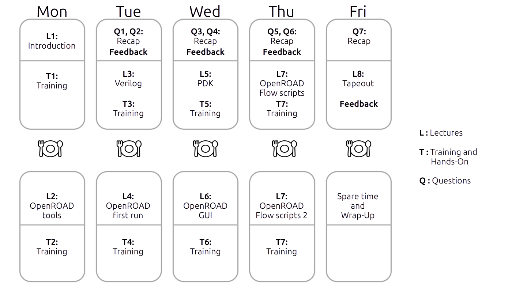

# Course
Home of the open-source EDA course.
Development of this course is funded by a public German
project `FMD-QNC (16ME083): https://www.elektronikforschung.de/projekte/fmd-qnc  

### License
Apache 2.0

### Code of conduct

There is a code of conduct for this repository. Please read it. It is the same code of conduct as in the IHP open-source PDK.


## Course instance: 1 Week, hands on


## Get the slides

The course is written in Markdown files. 
Pandoc is used to build the slides from that markdown.
An augmented LaTeX template is used and contained in the repository.


There are three ways to get the course slides.

### 1. Release

Download the lasted release in a packed container:
https://github.com/OS-EDA/Course/releases

This is the recommended way.

### 2. Pre-build pdf slides

Download pre-build slides from the build directory. 
https://github.com/OS-EDA/Course/tree/main/build

This option does not give much information about the consistency of the slide set.

If you just want to have a look around or look for a single slides this is the way to go.

### 3. Build the slides

#### Prerequisites
* Tex Full installation including language english
* Pandoc >= 3.4

#### Build

The shell script ```./generate_slides.sh``` builds the slides into the build folder.

A pre-build slideset resides in the build folder.

