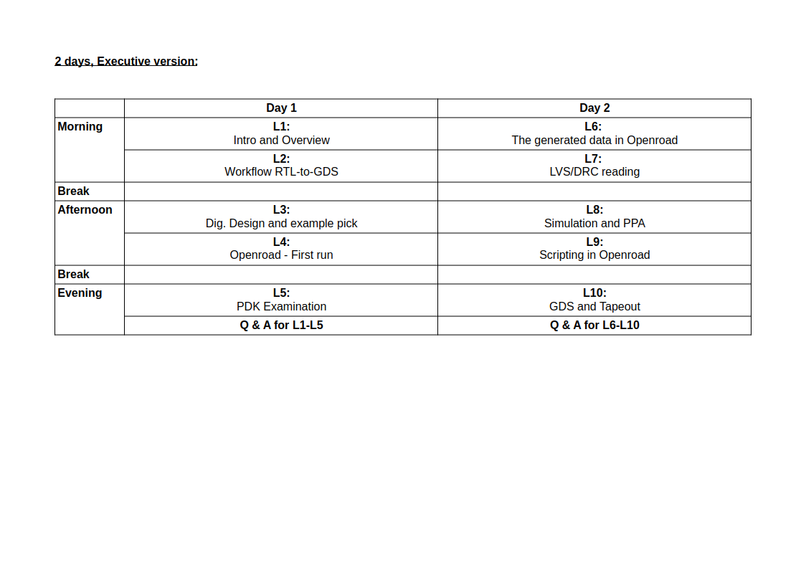

# Course
Home of the open-source EDA course.
### License
Apache 2.0
## Content
### 1. Intro and Overview
* Lecture
* Questions
### 2. Workflow RTL-to-GDS (Openroad)
* Lecture
* Questions
### 3. Digital design and example pick
* Lecture
* Questions
* Training
### 4. Openroad: First run
* Lecture
### 5. PDK Examination (IHP130)
* Lecture
* Questions
* Training (?)
### 6. The generated data in Openroad
* Lecture
* Questions
* Training
### 7. LVS/DRC reading (IHP130)
* Lecture
* Questions
### 8. Simulation and PPA
* Lecture
* Questions
* Training
### 9. Scripting in Openroad
* Lecture
* Questions
### 10. GDS and Tapeout (IHP130)
* Lecture
* Questions
### Overview:
| Nr. | Lecture | Questions | Training |
|---|:---:|:---:|:---:|
| 1 | L1 | Q1 | - |
| 2 | L2 | Q2 | - |
| 3 | L3 | Q3 | T3 |
| 4 | L4 | Q4 | T4 |
| 5 | L5 | Q5 | T5 (?) |
| 6 | L6 | Q6 | T6 |
| 7 | L7 | Q7 | - |
| 8 | L8 | Q8 | T8 |
| 9 | L9 | Q9 | - |
| 10 | L10 | Q10 | - |

## Course instance: 5 days, Full hands on

## Course instance: 2 days, Executive version
